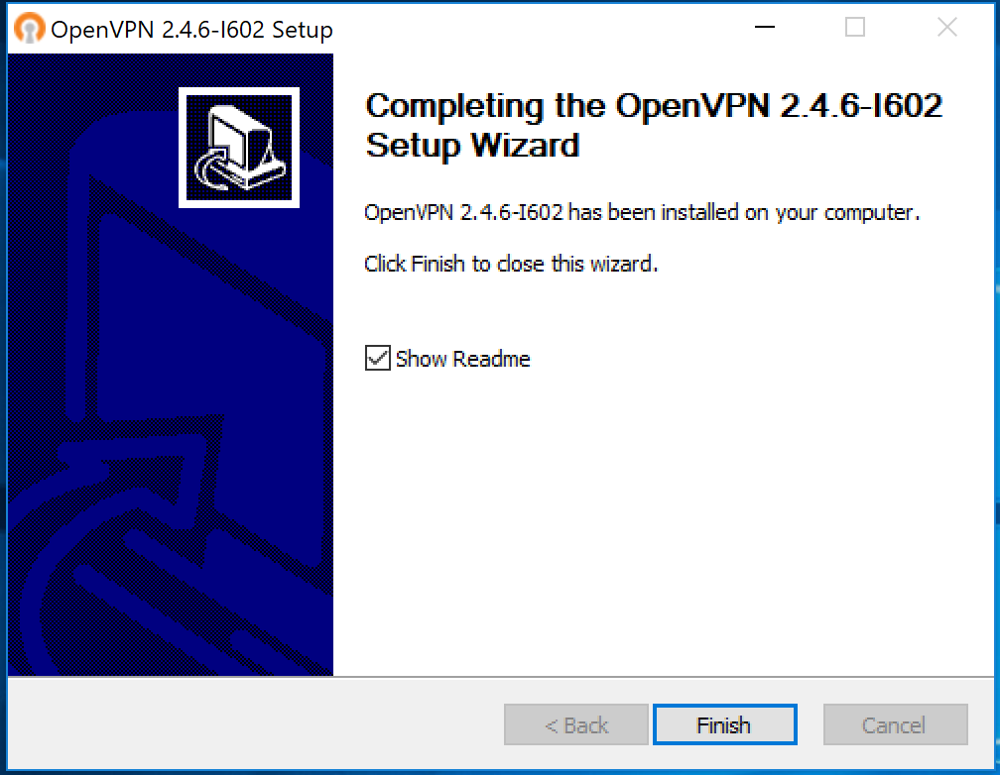

In order to use the HackerOne VPN, you need to install a VPN client that supports OpenVPN.

Refer to these installation and configuration instructions for your platform:

* [Windows](#windows)
* [macOS](#macos)

<h3 id="windows">Windows</h3>

1. Download the OpenVPN **Windows Installer** from <a href="https://openvpn.net/community-downloads/" target="_blank">this page</a>.

2. Execute the OpenVPN Installer.

3. When prompted, select these components:
   * OpenVPN Service
   * Tap Virtual Ethernet Adapter
   * OpenVPN GUI

4. When prompted to install a network adapter, click **Install**.

5. Click <b>Finish</b> to complete the setup.

7. Start the OpenVPN GUI application

8. Right click the OpenVPN icon in the bottom right corner of the screen, and click <b>Import file...</b>

9. Select the `*.openvpn` file you have downloaded from HackerOne (See [Accessing your VPN Credentials](/hackers/configure-the-hackerone-vpn.html)).

10. Right click the OpenVPN icon on the bottom right corner of the screen, and click <b>Connect</b>

The VPN will start connecting.

<h3 id="macos">macOS</h3>

1. Install [Tunnelblick](https://tunnelblick.net/cInstall.html).
2. Start Tunnelblick.
3. Find the `*.openvpn` file you have downloaded from HackerOne (See [Accessing your VPN Credentials](/hackers/configure-the-hackerone-vpn.html)).
4. Drag it onto the Tunnelblick icon at the top of your screen.
5. Click the Tunnelblick icon, and click the HackerOne VPN connection.

Your VPN will now be connected.
