In order to use our VPN Service, we require you to install the HackerOne VPN Root CA.

### Select your Platform

* [Windows](#windows)
* [macOS](#macos)
* [Ubuntu/Debian Linux](#ubuntu)
* [Firefox](#firefox)\*

> \* Firefox manages its own trusted certificate list, so you always need to add the root authority certificate to the browser even if you have installed it system wide.

<h1 id="windows">Windows</h1>

1. [Download the HackerOne VPN Root CA](https://hackerone-vpn-service.s3.amazonaws.com/hackerone-vpn-service.crt)
2. Double-click on the certificate file

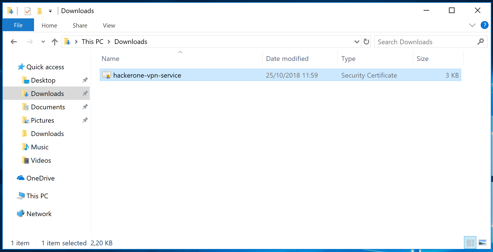

3. Click the "Install Certificate.." button

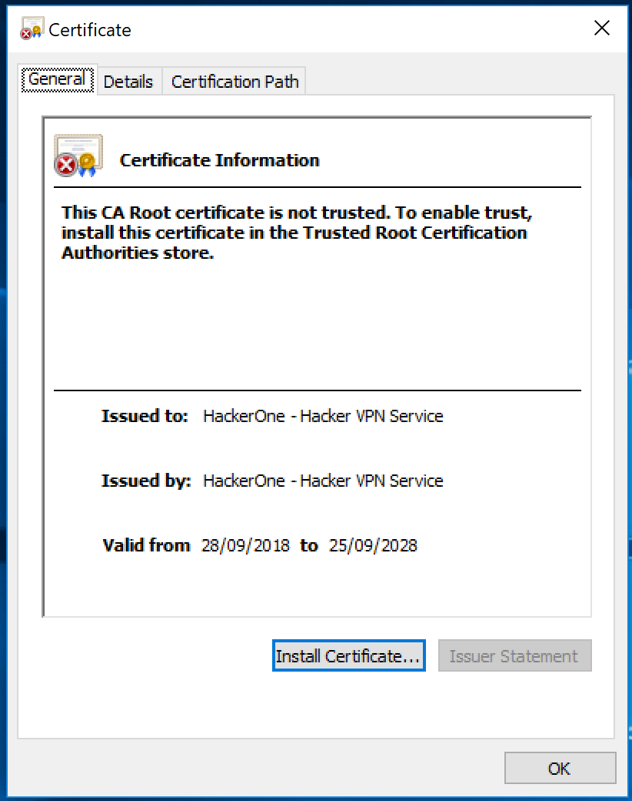

4. Select "Local Machine" and click "Next"

5. Click the "Yes" button to allow the changes

6. Select "Place all certificates in the following store"

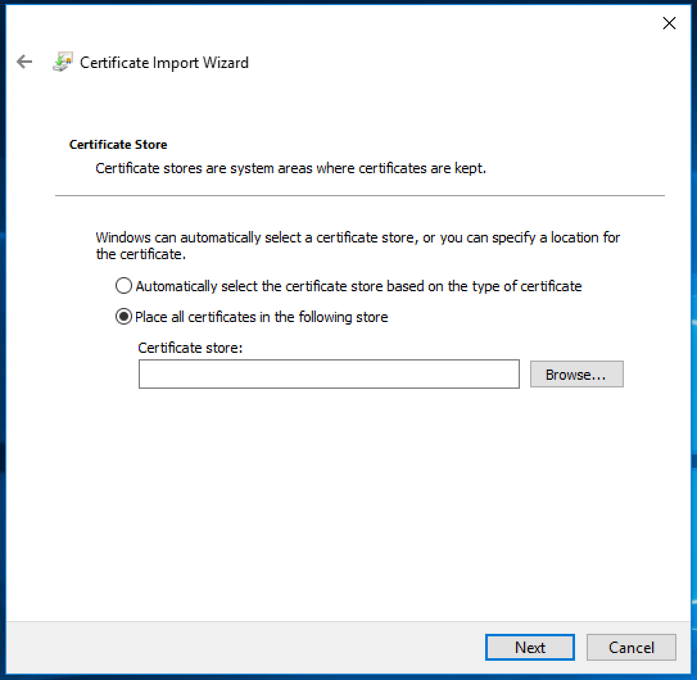

7. From the list, select "Trusted Root Certification Authorities", and click "OK"

8. Click "Finish"

<h1 id="macos">macOS</h1>

1. [Download the HackerOne VPN Root CA](https://hackerone-vpn-service.s3.amazonaws.com/hackerone-vpn-service.crt)
2. Double-click on the certificate file

3. Enter your administrator password.

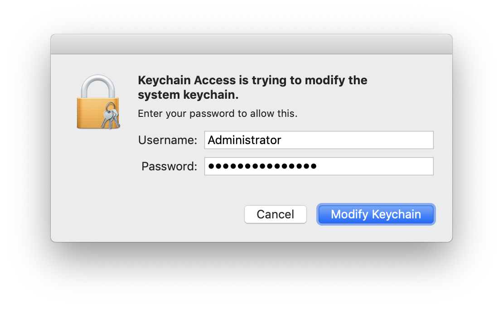

4. Double-click on the HackerOne VPN certificate in KeyChain Access

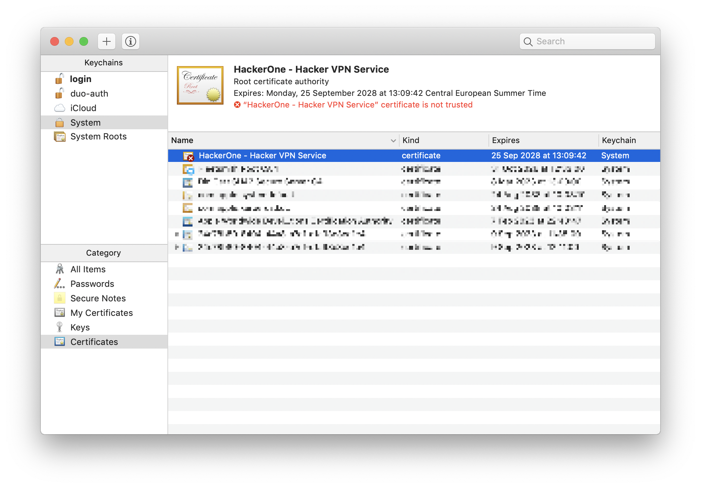

5. In the window that appears, set the certificate to "Always Trust"

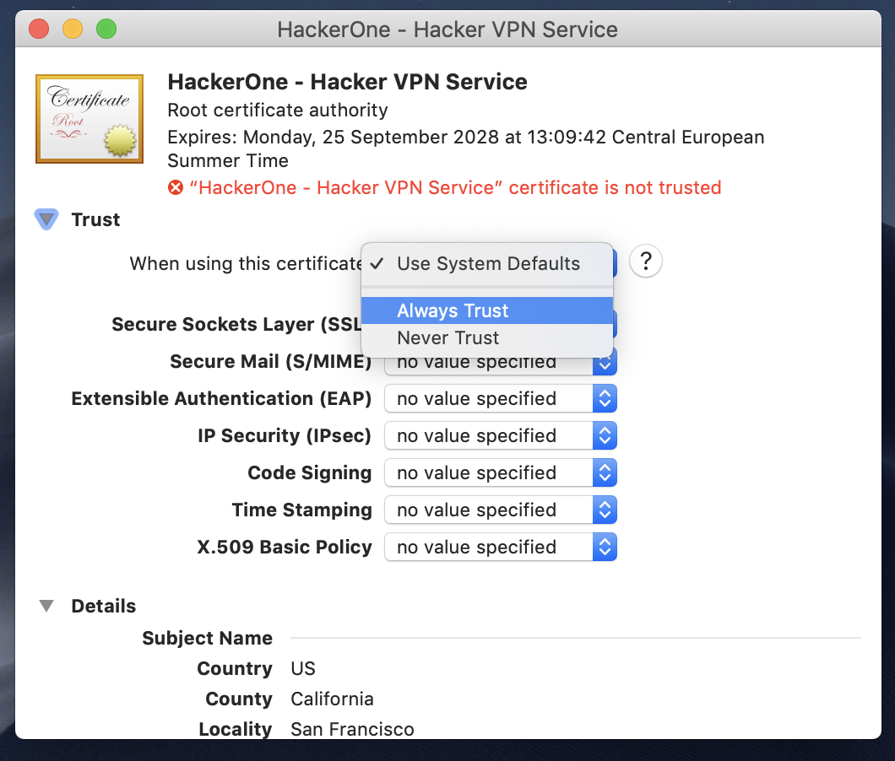

6. Re-open the certificate in Keychain Access. The VPN Certificate should now be trusted by the operating system.

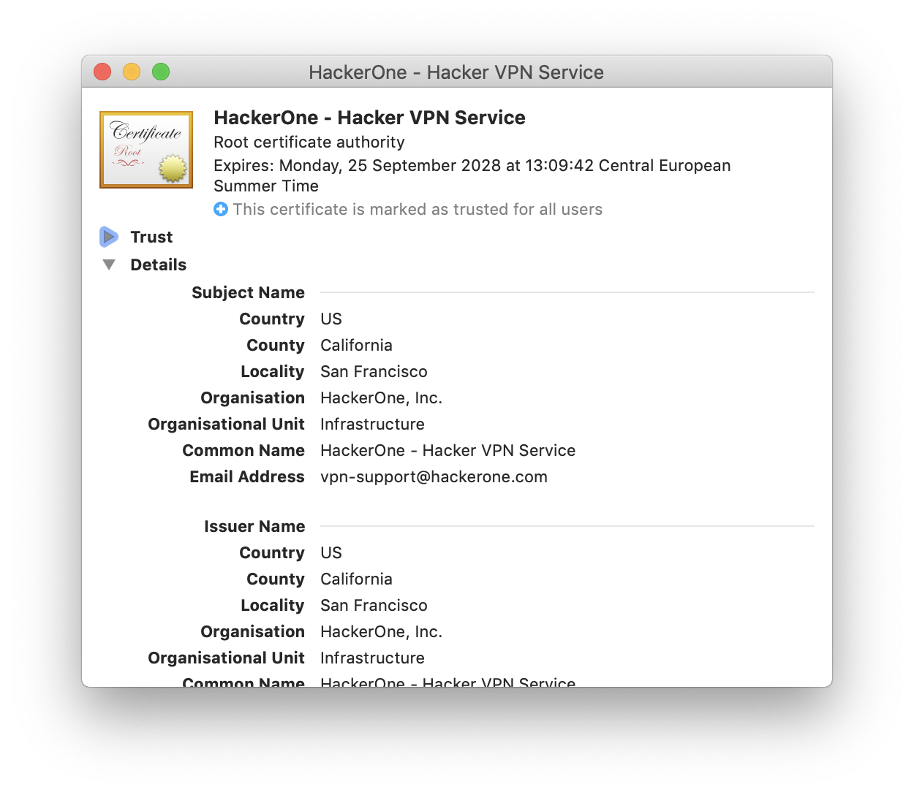

<h1 id="ubuntu">Ubuntu/Debian Linux</h1>

Execute the following commands in your terminal to download and install the HackerOne Root CA:

1. `cd /usr/local/share/ca-certificates`
2. `sudo wget https://hackerone-vpn-service.s3.amazonaws.com/hackerone-vpn-service.crt`
3. `sudo update-ca-certificates`

You will notice that the command reports it has installed one (or more) new certificates.

The certificate has been successfully added to the Operating System.

<h1 id="firefox">Firefox</h1>

1. [Download the HackerOne VPN Root CA](https://hackerone-vpn-service.s3.amazonaws.com/hackerone-vpn-service.crt)
2. Open Preferences, and go to "Privacy & Security"
3. Scroll down to the "Certificates" section, and click "View Certificates..."

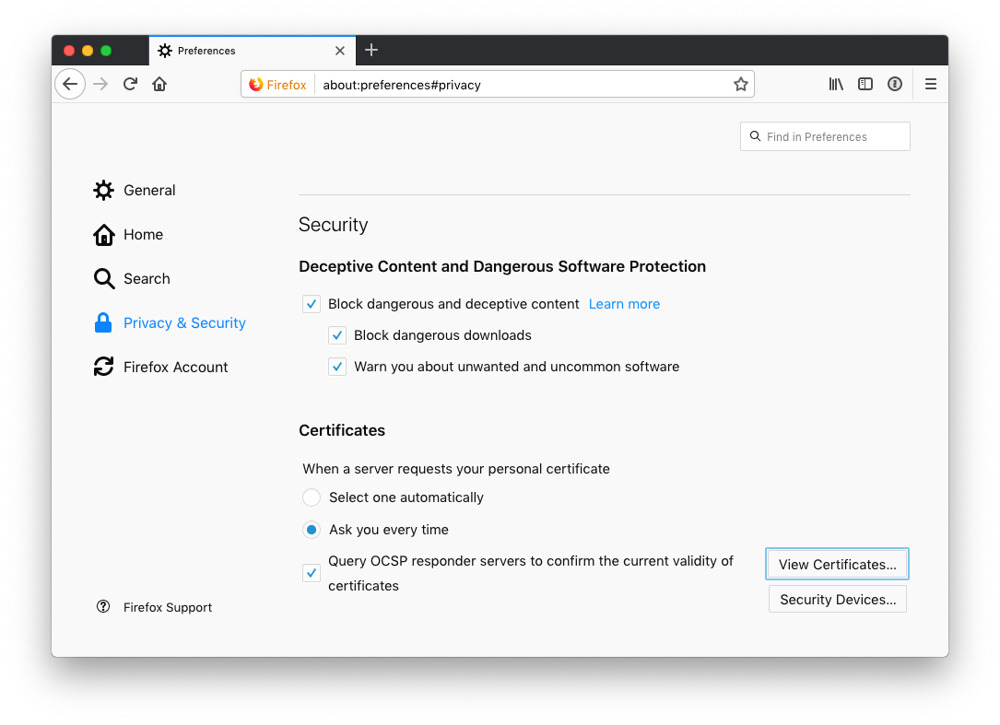

4. Click the "Import..." button

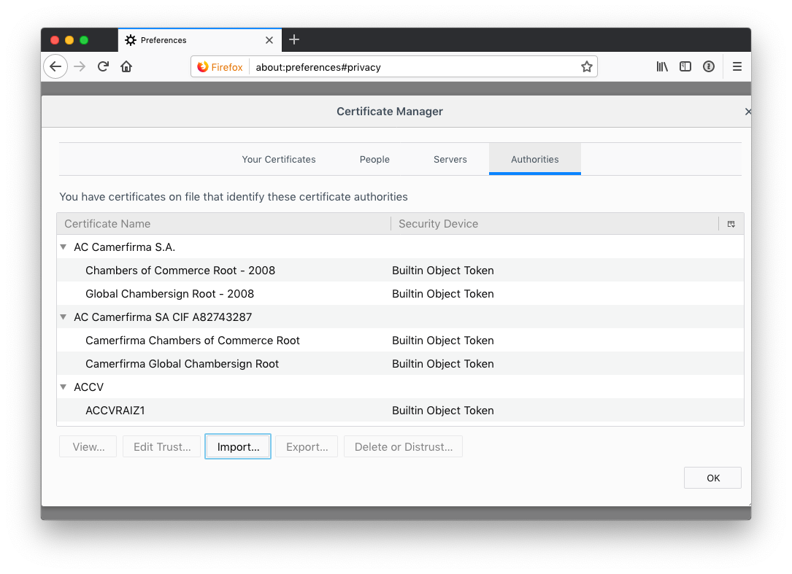

5. Select the "hackerone-vpn-service.crt" file

6. Check "Trust this CA" to identify websites" and click "OK"

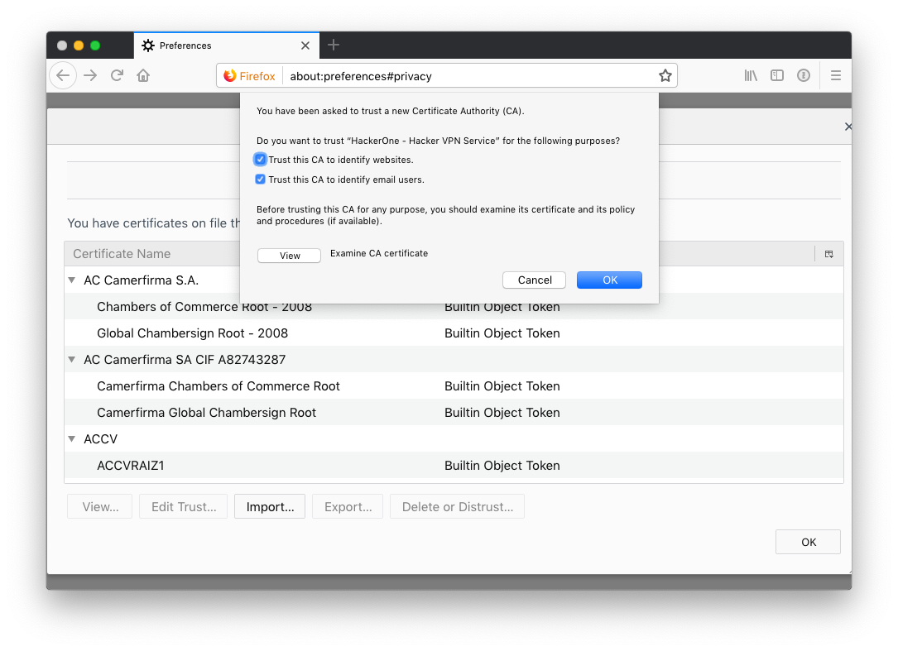

7. Notice that the "Hackerone - Hacker VPN Service" certificate is now visible in the list

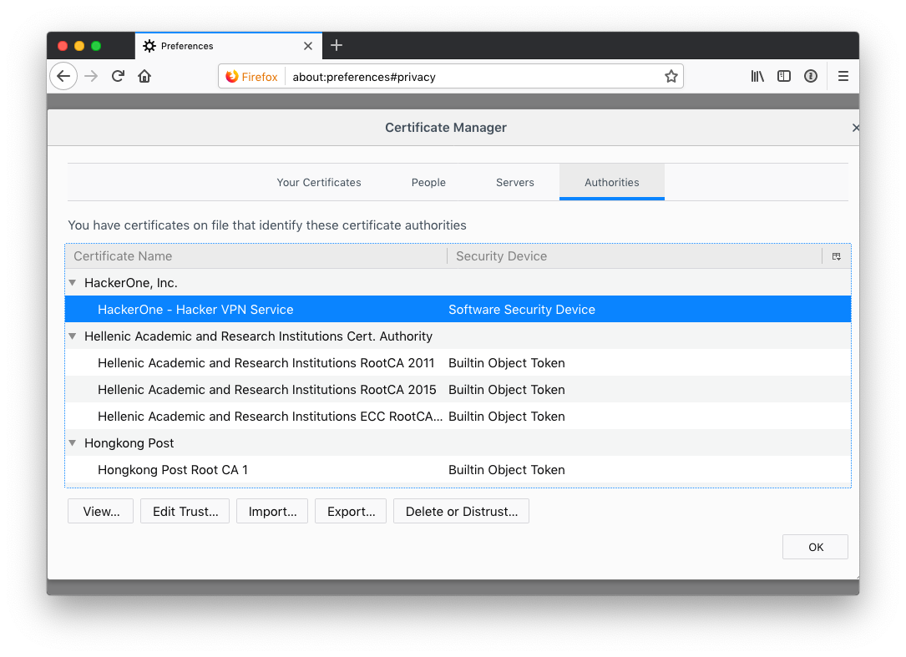
