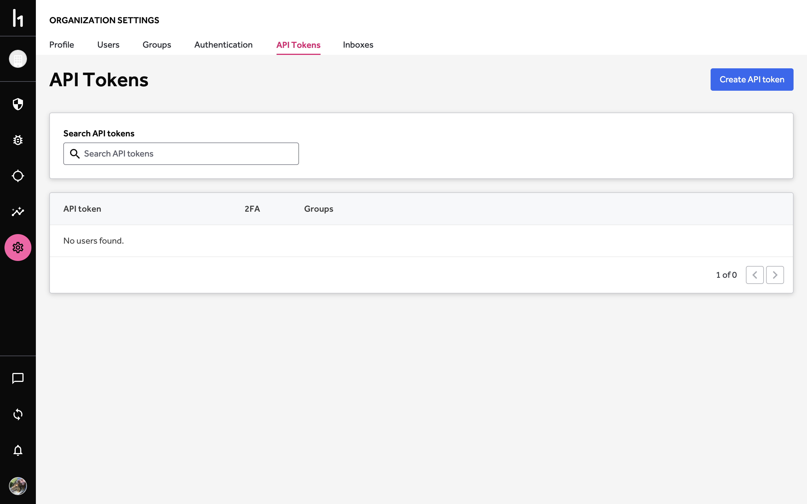
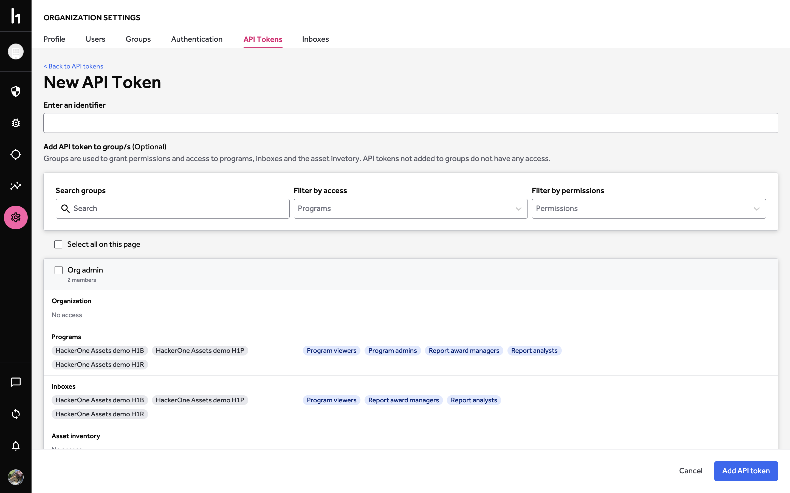
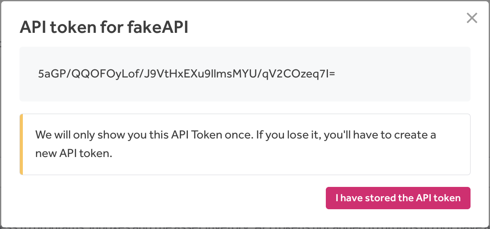

Your program’s administrative users can generate and manage API tokens to experiment with or use the HackerOne API. The API token identifier and value are used as the username and password for HTTP Basic authentication.

To generate an API token:
1. Go to <b>Organization Settings > API Tokens</b>.

2. Click <b>Create API Token</b>.

3. Enter an identifier for the new API token.

4. Select the programs and groups you want to add this token to. When no groups are selected, they only have read-only permissions. The default groups you can choose from are:

Option | Details
------ | -------
Standard | This group has Report and Reward permissions.
Admin | This group has Admin and Program permissions.

If your program has more groups, you can choose from those groups as well.

5. Click <b>Create API token</b>

6. Store the generated API token.

7. Click <b>I have stored the API Token</b>.

Once you've generated your API token, you'll receive a confirmation email stating that you’ve created a new API token. To learn more about the HackerOne API, check out our [API docs](https://api.hackerone.com/#introduction).

*Note: h1 as a username prefix is locked and restricted to HackerOne employees only. This means that effective December 2022, HackerOne users will no longer be able to use h1 at the beginning of handles; this includes usernames, program handles, and API tokens.*
