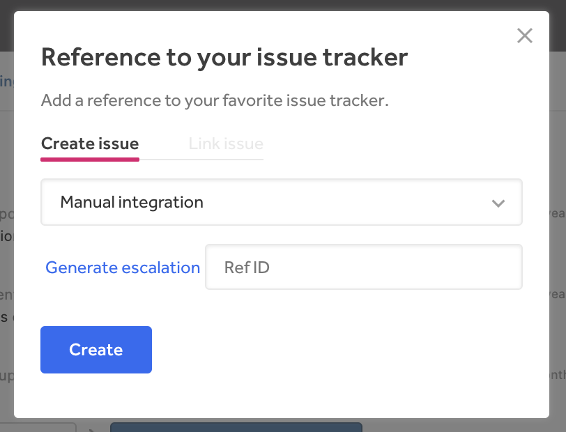

With the Assembla integration, HackerOne makes it easy for you to track Assembla issues as references on HackerOne.

In order to configure the Assembla integrations for your team, [contact HackerOne](support.hackerone.com) with the following information to start the integration process:

* The ID of the Assembla space to use (e.g. “company”)
* Any other custom/specific fields you’d like pre-populated such as the component, milestone, priority, permission type.

><i>Note: For most fields, HackerOne requires the actual numeric ID of the field value and not the label/string.</i>

With all of the provided information, HackerOne will be able to set up your requested integration. You’ll get an email notification letting you know that your integration has been set up within 1-2 business days.

### How the Integration Works
After your Assembla integration has been set up:
1. Change the action picker to **Change state > Triaged** in your report.

2. Click **Add reference to issue tracker**.
3. Make sure your Assembla integration is selected.

4. Click **Generate escalation**. You’ll be taken to your Assembla account where the report is pre-populated.
3. Submit the issue to create the report in Assembla.
4. Copy the Assembla report issue number and paste it in the **Reference ID** field back in the HackerOne.
5. Click **Create** to create a direct reference link to the issue in Assembla.
