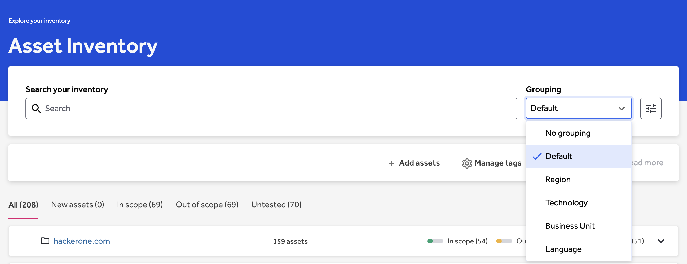
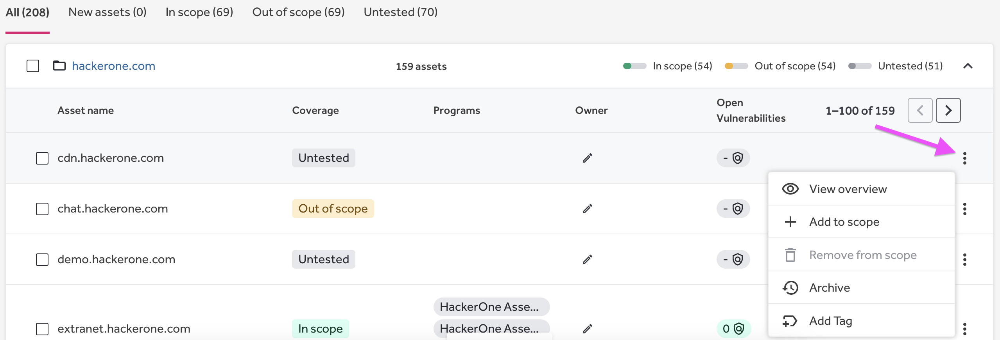
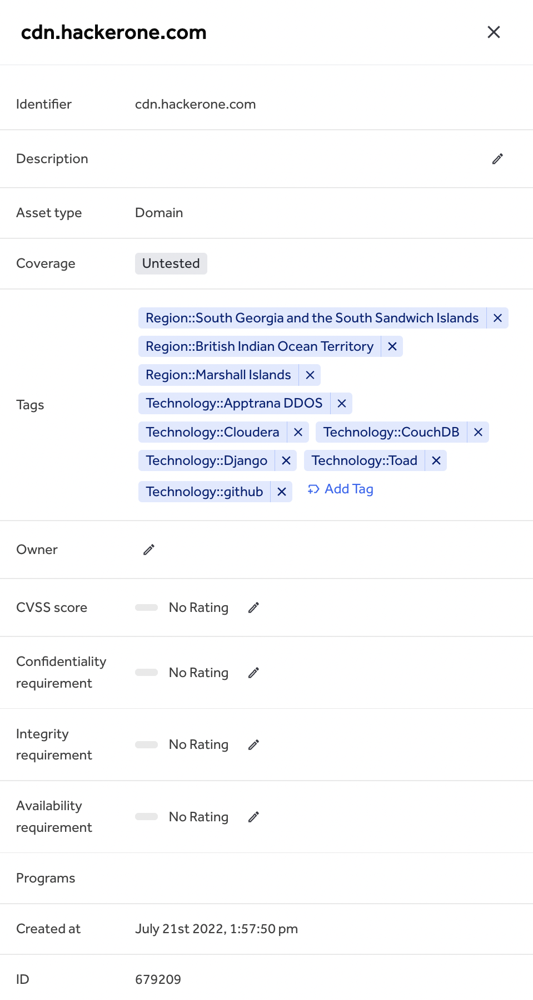
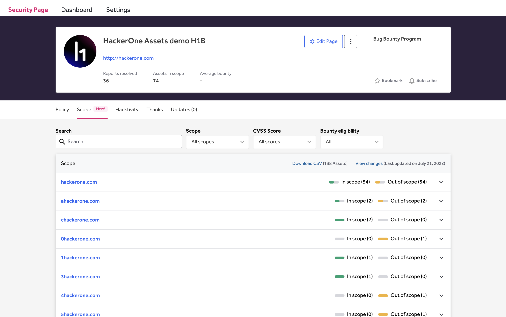

Your organization’s Asset Inventory page allows you to create categories for assets across your organization.

Asset Inventory is a centralized interface within the HackerOne Platform that allows you to control and manage assets across various security testing engagements.
This feature helps manage the scope across all customer segments. Over time, it becomes a unified record for global external assets and security testing efforts and simplifies the attack surface management process.

HackerOne Assets customers get access to complete Asset Inventory features to manage their attack surface as well as the testing scopes

>Note: The Asset Inventory is only viewable to organization admins or users with Asset Manager or Asset Viewer permissions.

You can choose how to group assets based on tags; by default, they are grouped by domain. Clicking on a group opens a detailed list of all assets under that tag. From there, you can edit them individually or in bulk. Each asset listed shows information on coverage, program, owner, and open vulnerabilities.

### Asset Details
Opening the menu for an asset gives you options to view the asset overview, add scope, remove from scope, archive, or add a tag. You can also add tags and add or remove from scope in the bulk actions menu.

The asset overview will provide detailed information which you can edit from within the menu.

### Scope
You can add to scope, remove from scope, or add as out of scope by clicking on the kabob menu to the right of any asset.

To add as in scope or out of scope:
1. Click the kabob menu next to the asset
2. Click **Add to scope**

3. Select the program
4. Define the scope 
5. Set bounty eligibility
6. Check or uncheck the box **Notify subscribers of changes to the scope**
7. Click **Add scope**

The Scope tab in the program’s Security page allows hackers to see:
1. Which assets are in-scope or out-of-scope
2. Which assets are eligible for bounty
3. Asset CVSS environmental score

### Adding Assets

You can add assets to your organization from the Asset Inventory page by clicking **Add assets** under the search & filter box. A pop-up menu will appear prompting you to enter all the asset’s details.
*Note: Assets can also be added via the [API](https://api.hackerone.com/customer-resources/#assets). ASM Scanner and Asset submission review flows are available when you purchase HackerOne Assets.*

The asset will appear in the list alongside all other assets.

### Filtering

Click the filter button next to the Search bar to filter assets by category or tag.

### Categories & Tags
The standard Asset Inventory comes with built-in categories and tags such as technology and region. Customers who purchase the Assets Package will also gain access to custom categories and tags. 

To create a new category:
1. Click **Manage tags**

2. Click **Create**
3. Select **New Category**
4. Name the category
5. Click **Create tag category** to finish

To create a new tag:
1. Click **Manage tags**
2. Click **Create**
3. Select **New tag**
4. Select a category for the tag to go under
5. Name the tag
6. Click **Create tag** to finish

**Note:** You must create and select a category before you can create tags.

### Advanced Features
Purchasing the Assets feature also unlocks the Attack Surface Coverage dashboard and Asset Submissions. 

Your Attack Surface Coverage dashboard gives an overview of your entire attack surface. It summarizes the total number of in-scope and out-of-scope assets across your program and also shows a summary of vulnerabilities found based on region, language, technology, or business unit.

Asset Submissions allows hackers to submit potentially missed assets for review. You can then accept or reject these assets as part of your organization. If you accept a hacker’s submission, they will then be invited to submit asset enrichment to provide more details about technology tags, CVSS environmental score, and maximum severity.

