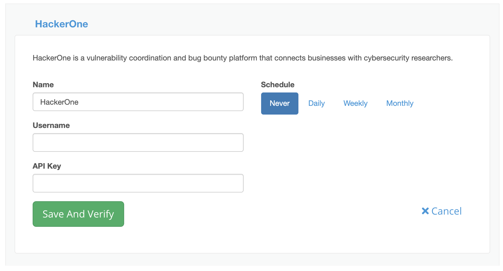

You can import HackerOne reports into the Kenna Security platform using the integration built between HackerOne and Kenna Security. This integration uses the HackerOne API, and you'll need to create a HackerOne API token to get started.

> **Note:** This integration is built and maintained by Kenna Security. For questions please reach out to support@kennasecurity.com.

### Setup

To set up the HackerOne connector on the Kenna Security platform:
1. [Create an API token]( https://docs.hackerone.com/organizations/api-tokens.html) on HackerOne.
2. Log in to your Kenna Security account
3. Click **Connectors**.  
4. Click **Add Connector**.

5. Select *HackerOne*.

6. Enter the API username and token that you created.

7. Set the schedule to *Daily*, *Weekly*, or *Monthly*.
8. Click **Save And Verify**.

### How it works
Once you’ve set up the HackerOne connector and configured the integration, data will be automatically pulled from HackerOne using the schedule you configured. All reports in the *New* and *Triaged* states will be imported in the Kenna Security platform as open issues. This integration will not push any updates made in the Kenna Security platform back to HackerOne. When you delete the connector, all data imported by the connector will also be deleted.
