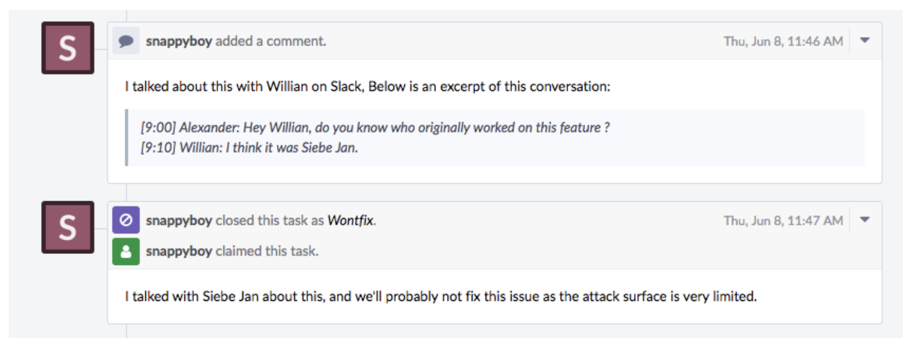
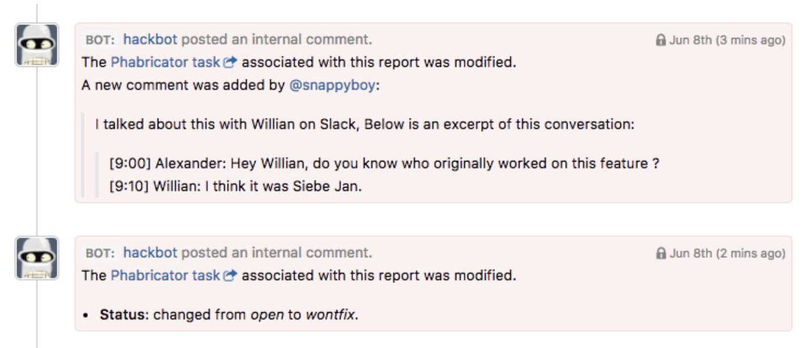

You can have a two-way integration between HackerOne and Phabricator in which whenever a comment is added or there’s a state change in a Phabricator task, an internal comment is posted on the associated HackerOne report. Vice versa, any actions done on HackerOne are shown in Phabricator.  

To integrate with Phabricator:
1. Go to <b>Settings > Program > Integrations</b>.
2. Click <b>Connect with Phabricator</b>.

3. Generate a conduit API token by following steps 1-2 in the <b>Generate Conduit API Token section</b>.
4. Enter your <b>Phabricator Instance URL</b> and the <b>Generated API token</b>.
5. Click <b>Authenticate with Phabricator</b>.
6. Set the escalation settings by entering the default title and description in the <b>HackerOne to Phabricator Escalation settings</b> section.
7. Select the events you want notifications for from Phabricator to HackerOne. (<i>Note: Syncing of events is only available for Professional and Enterprise customers.</i>) You can select from:

Option | Details
------ | -------
Status changed | An internal comment is posted onto HackerOne when a Phabricator task changes status.
Comment added | An internal comment is posted onto HackerOne when a new Phabricator comment is added.

8. Select the actions you want notifications for from HackerOne to Phabricator. You can select from:

Option | Details
------ | --------
Status changed | An internal comment is posted onto Phabricator when a HackerOne task changes status.
Comment added | An internal comment is posted onto Phabricator when a new HackerOne comment is added.

9. Click <b>Save changes</b>.

You can now view updates to Phabricator tasks within a HackerOne report and vice versa, view updates to HackerOne reports within Phabricator.

See how the integration looks in Phabricator and HackerOne below:

* Phabricator:

* HackerOne:

