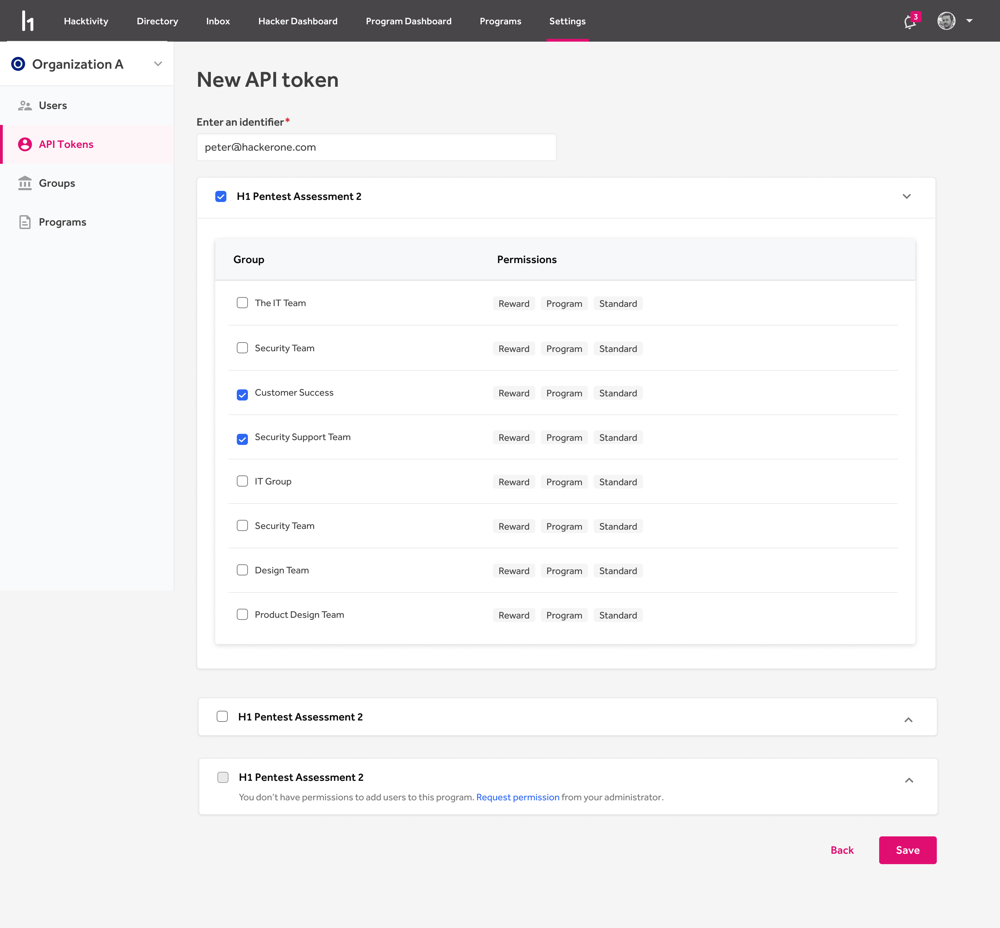

Your program’s administrative users can generate and manage API tokens to experiment with or use the HackerOne API. The API token identifier and value are used as the username and password for HTTP Basic authentication.

To generate an API token:
1. Go to <b>Settings > Program > Automation > API</b>.

2. Click <b>Create API Token</b>.

3. Enter an identifier for the new API token.

4. Store the generated API token.
5. Click <b>I have stored the API Token</b>.

You’ll get a confirmation email stating that you’ve created a new API token. You can manage the groups that have access to the API tokens and revoke the token as well.

To learn more about the HackerOne API check out our [API docs](https://api.hackerone.com/docs/v1).

### Managing Groups
To manage which groups have access to the API tokens:
1. Click <b>Manage groups</b> on the API settings page for the identifier you want to manage groups for.

2. Select which groups you want to give permissions to. When a group isn’t selected, they only have read-only permissions.
3. Click <b>Apply changes</b>.

