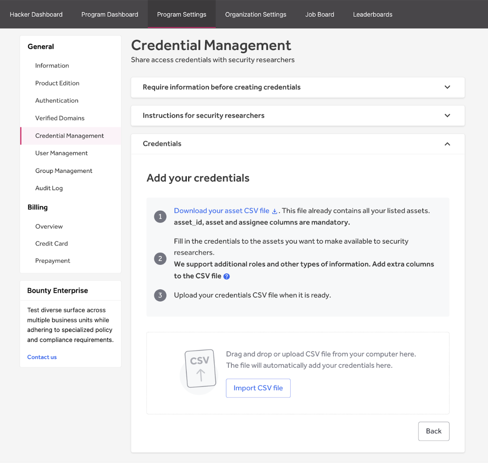
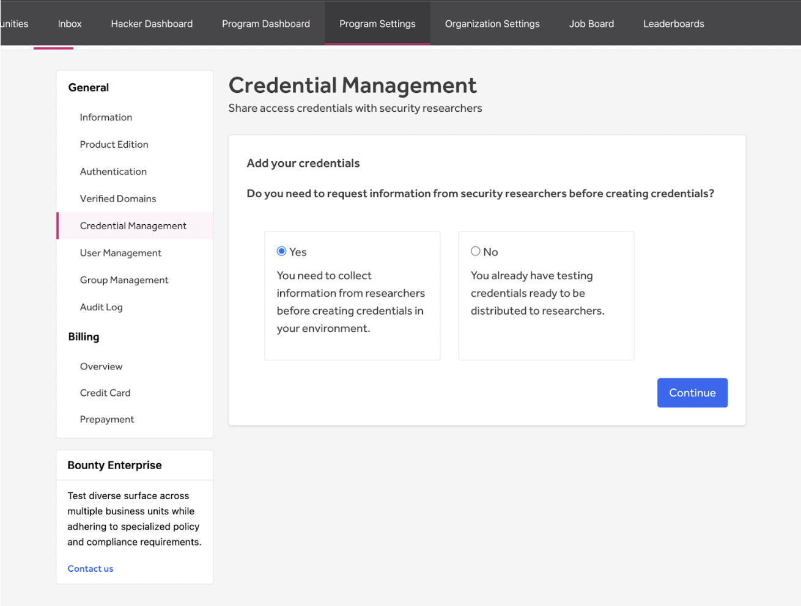
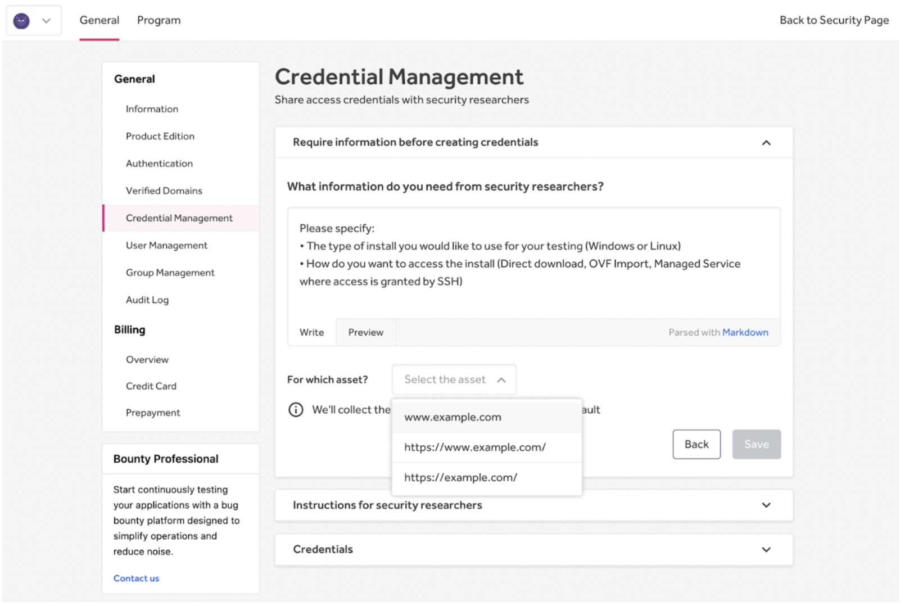
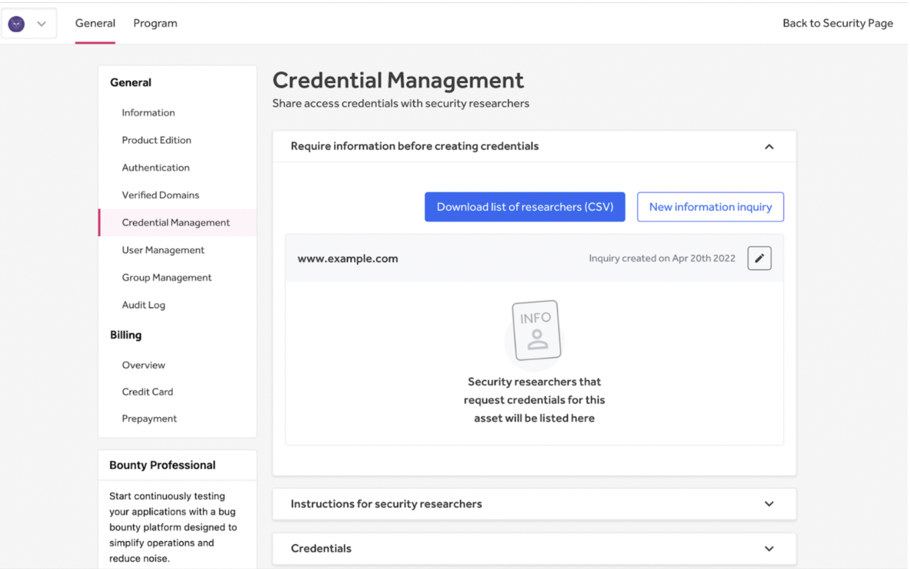
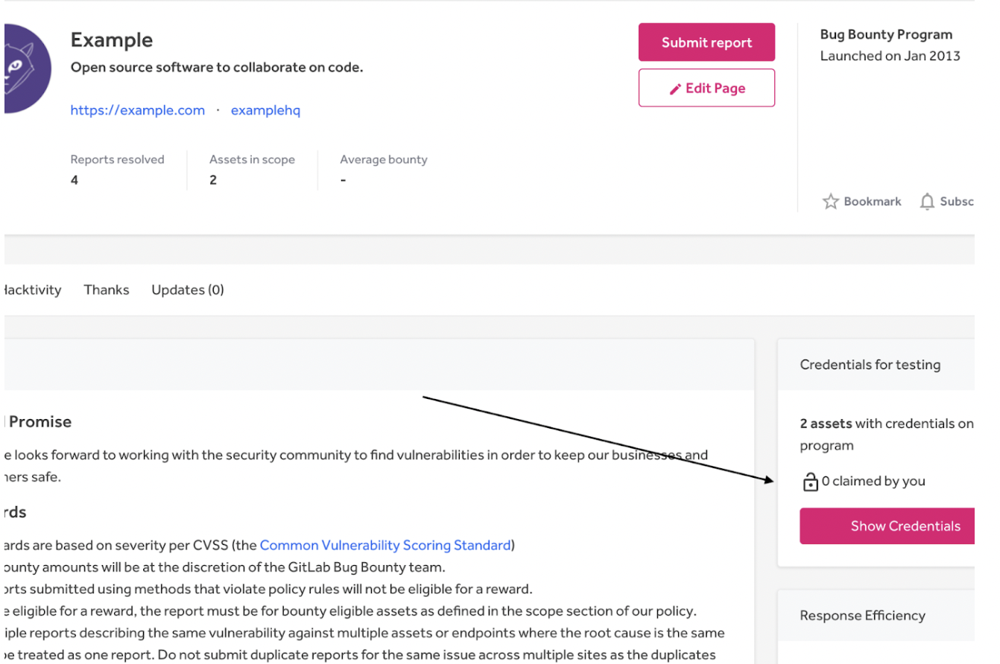
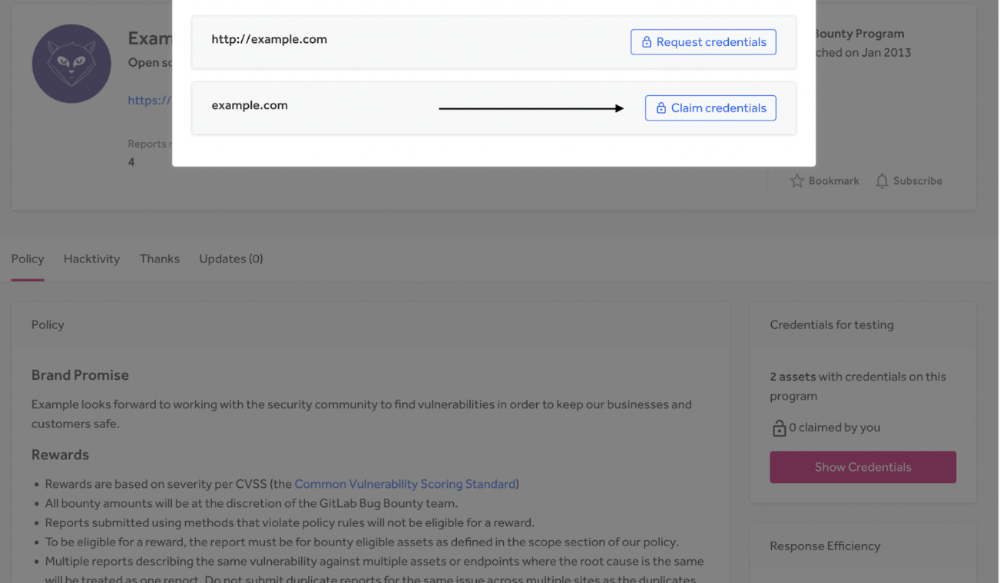
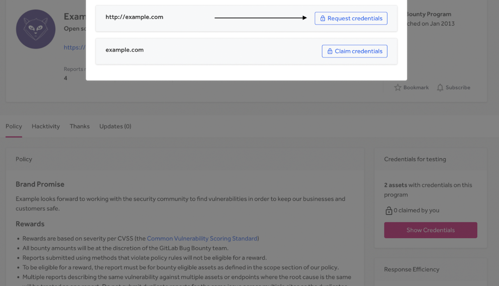
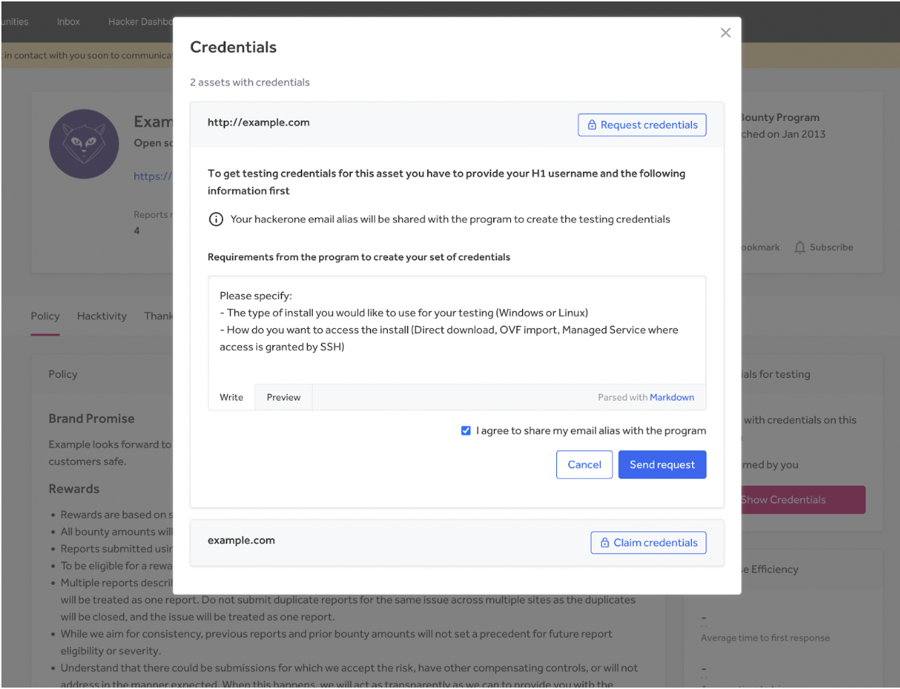
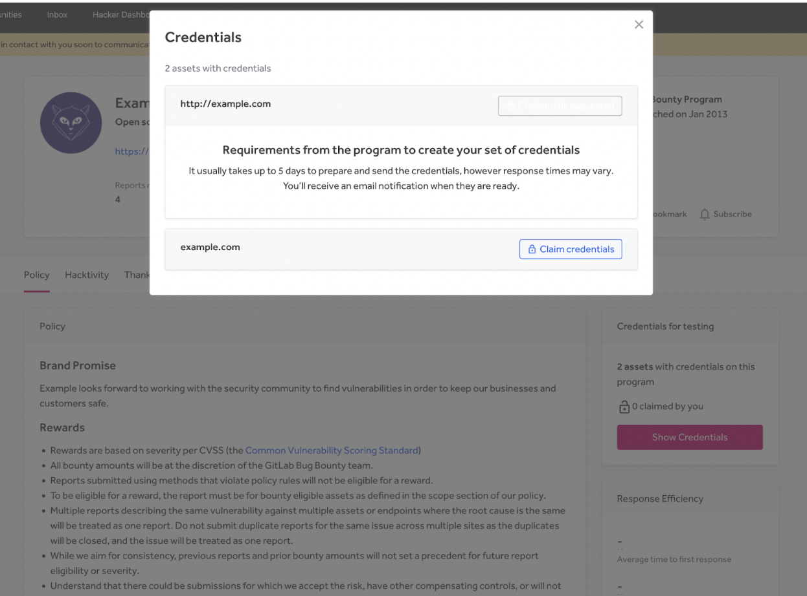

In order to better manage who is allowed to hack on specific programs, you may issue Credentials to be claimed by invited hackers. These credentials allow a hacker access to private areas by way of granting them a login and password for those specific areas.

Credentials can be granted based on Team or Asset. This setting can be changed by your program manager.

### Asset-Based Credentials
Asset-based credential management has additional steps of downloading a template which contains some pre-filled information about your project. Once you complete and upload the template, credentials will be assigned to the specified hackers.

Programs can download their asset file, modify it, and re-upload their CSV.

#### CSV Format
When you navigate to the credentials area, you will see an option to first download the template which will auto-populate some of the fields with information from your project. The **Asset ID** and **Asset information** are required in the CSV when using Asset-specific credentials. The **Assigned To column** can be left empty if there is no credential inquiry required, and any hacker can claim the credentials.

**Note:** For Team-specific credentials, those two categories are not required. See the example below.

Asset ID | Asset | Assigned To | Username | Password
-------- | ----- | ----------- | -------- | --------
1 | https://hackerone.com | hacker-john | John | john123
2 | https://api.hackerone.com |  | Jacob | jingleheimer123
3 | https://hackerone-attachments.s3.amazonaws.com/ |  | Schmidt | johnjacob2

#### Multiple Credentials
Each hacker is allowed to claim one credential. If a hacker needs two logins, such as a regular account and an admin account, then both of those usernames and passwords can be put into the same credential for that hacker to claim. See examples below.

Table appearance:

### Credential Inquiry
In the first step of Credential Management you will select which flow you need. In case the program needs specific information about the end-user’s environment in order to prepare a set of credentials, you can create a credential inquiry. Via the Credential Management page, the program specifies what information you need from hackers and selects the asset for which the information is required.

The hacker provides the information via the program’s Policy Page.

When it’s not necessary to request information from the hacker before creating credentials, you can immediately add credentials.

You will see a list of hackers that requested credentials and provided the needed information.

### Hacker Assignment
#### Claiming Credentials

When a program has an asset that does not require information from a hacker, the hacker can claim a credential via the program’s Policy Page. Once the credential is claimed by the hacker, the credential is automatically assigned to them.

#### Requesting Credentials
When a program has a credential inquiry, the hacker can’t immediately claim credentials. First, they need to request credentials and provide the necessary information.

Once the information is provided, the hacker is put on a waiting list until the Program Manager creates the credential and assigns the hacker to these credentials.

### Credential Assignment
When creating a new credential and assigning the credential to a hacker via CSV upload. Once the credential is assigned the hacker is removed from the waiting list.

As the hacker provides the information, the Program Manager is notified every 5 days per e-mail. The information given by the hacker shows up in the list on the Credential Management page. From here you can download the list with credential inquiry responses.

#### Pre-Assigning Credentials
To assign credentials to hackers, you need to create a CSV file with credentials and put the hacker’s username to the (already provided) Assigned To column. This column can be left empty if there is no credential inquiry required, and any hacker can claim the credentials.

When the credential is assigned to a hacker, the hacker is notified. If a hacker is not a whitelisted reporter in the program, an error is raised.

### Edit, Revoke and Delete Credentials
If you need to edit a credential, you can do this by clicking on the edit button on the right side of the table.

#### Revoking Credentials
If a hacker has violated your policy or HackerOne’s code of conduct, you can revoke the credential rights of a hacker by clicking Revoke next to the username of the hacker. You'll also need to invalidate the account on your own platform to prevent the hacker from logging in and reset the password when you recycle the credential for another user.

Credentials are also automatically revoked when a hacker leaves a program for any reason. Make sure to reset the password when you recycle the credential for another hacker.

#### Delete All Credentials
If you want to delete all credentials on all the assets, click on the Reset button. This action will delete both the assigned and unassigned credentials.

