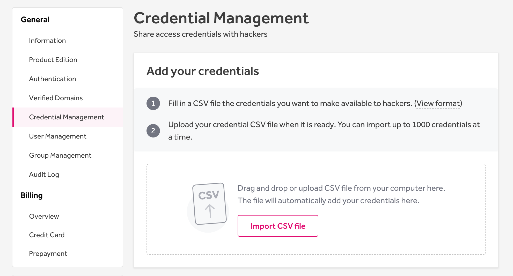
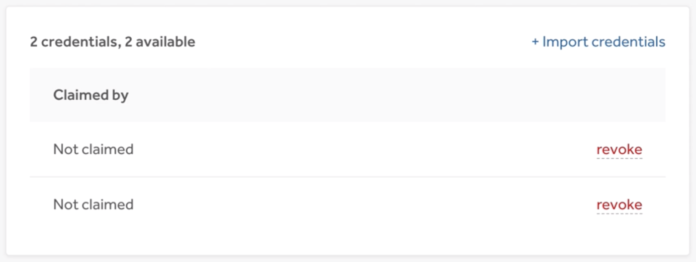
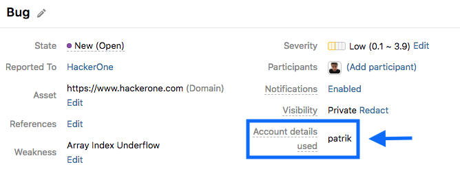
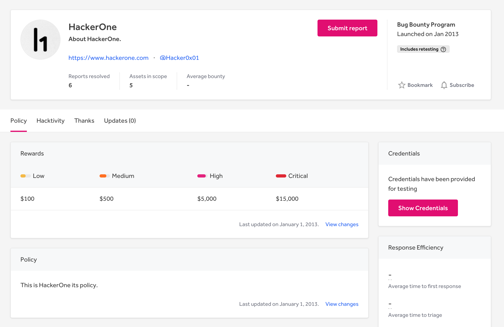
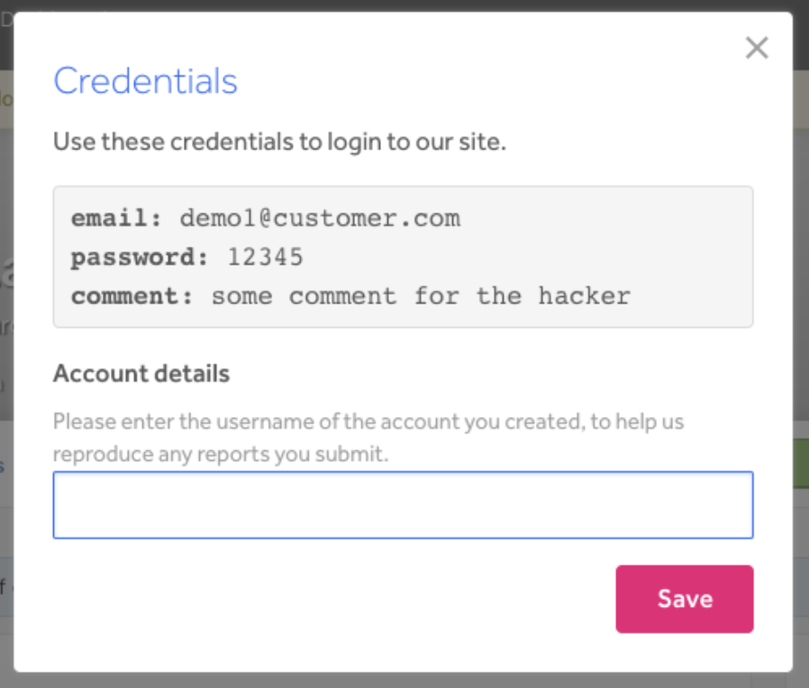

The Credential Management feature enables you to easily share access credentials with hackers so that you don't have to constantly create sign in credentials for each new hacker that participates in your program. This also enables participating hackers to quickly retrieve the credentials needed to find vulnerabilities in your program.

>Note: This feature is currently only available for private programs.

### Set Up
To set up Credential Management for your program:
1. Go to <b>Settings > General > Credential Management</b>.

2. Click <b>Import Credentials</b>.
3. Click <b>Upload CSV file</b> to upload the CSV file of credentials that you want to share. The CSV file supports a set of headers and values where each row is a set of credentials that can be claimed by a hacker.

4. Click <b>Next</b>.
5. Review your uploaded credentials in the preview window and click **Next**.

6. Write instructions you want to communicate to the hacker when they claim one of your credentials.

7. Click **Done**.

Your uploaded credentials will populate on your Credential Management page where you can see which credentials have or haven’t been claimed. Claimed credentials will also display the username of the hacker under the <b>Claimed by</b> column.

><i>If a hacker has violated your policy or HackerOne’s code of conduct, you can revoke the credential rights of a hacker by clicking <b>Revoke</b> next to the username of the hacker. You'll also need to invalidate the account on your own platform to prevent the hacker from logging in.</i>

The username of the account the hacker created using the provided credentials will display on the submitted report under the <b>Account details used</b> section.

### How It Works
Once you’ve set up credential management, hackers participating in your program will be able to retrieve their credentials by clicking the <b>Show Credentials</b> button on your security page.

The <b>Credentials</b> window will then display with instructions where the hacker can claim one of the credentials you’ve provided. They’ll be prompted to enter the username of the account they created using the credentials provided.

Hackers can only claim 1 set of credentials. If they want a second set of credentials, you can revoke their first set and then have them request for another. 
