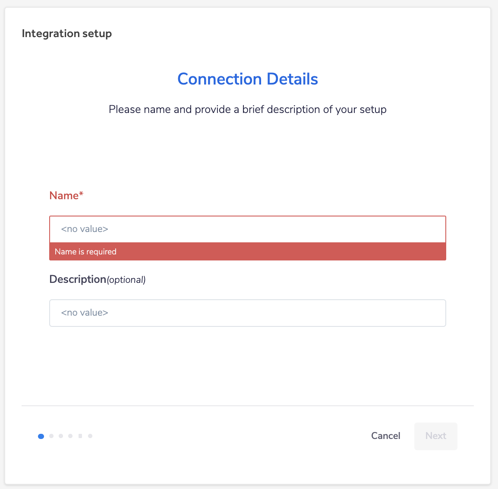
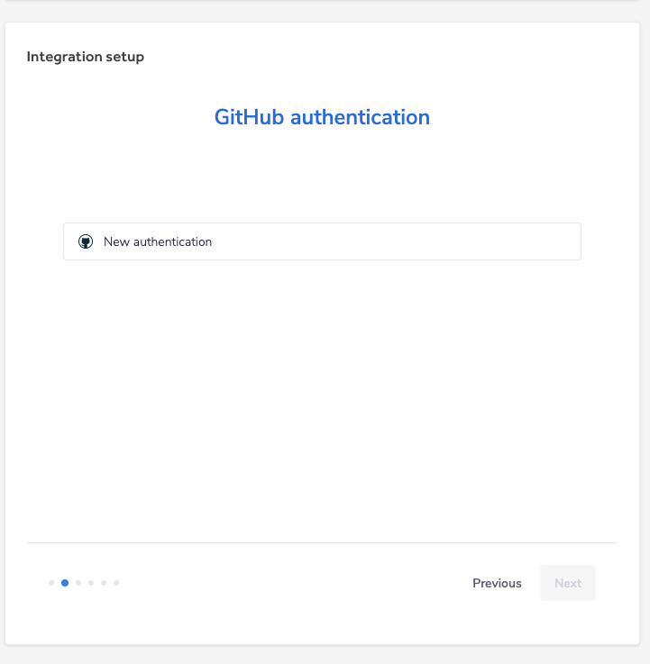
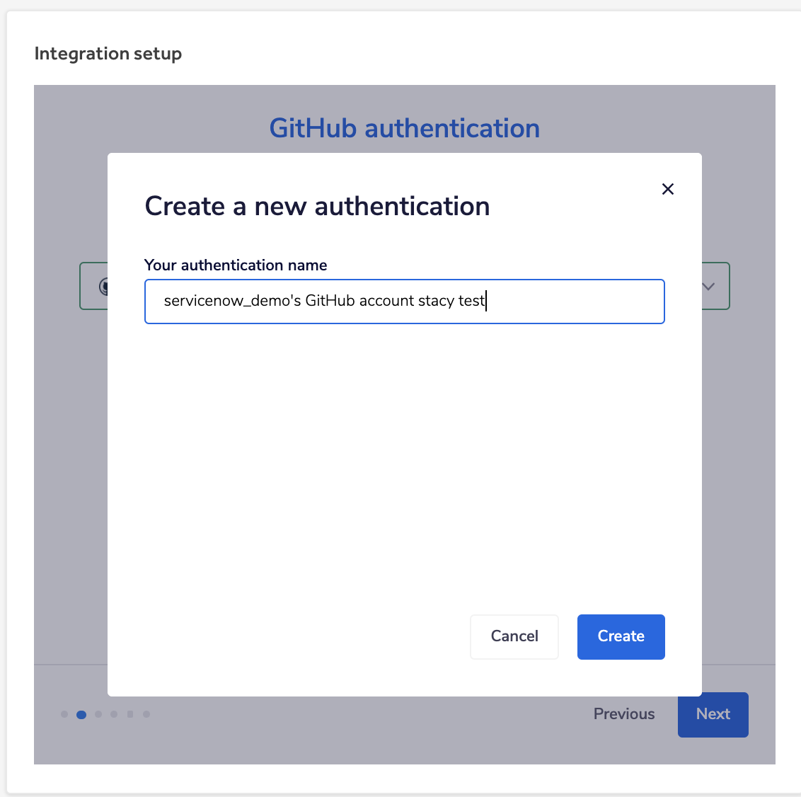
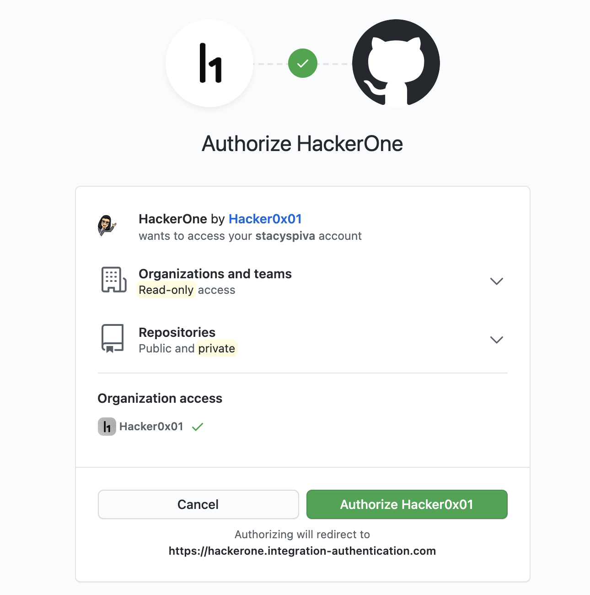
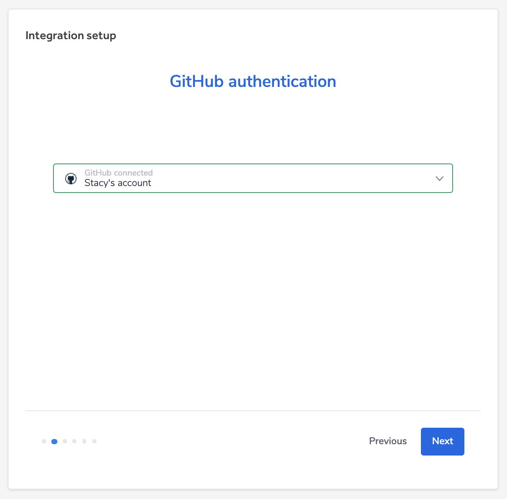
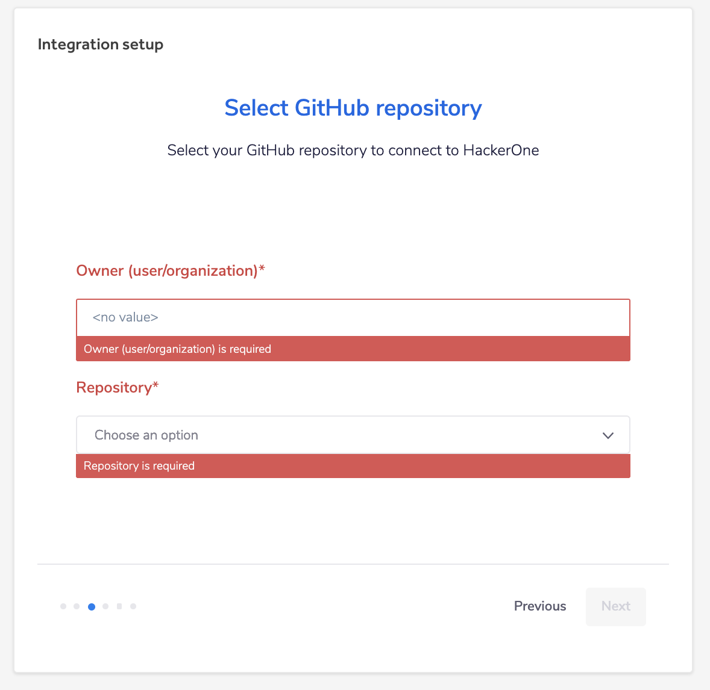
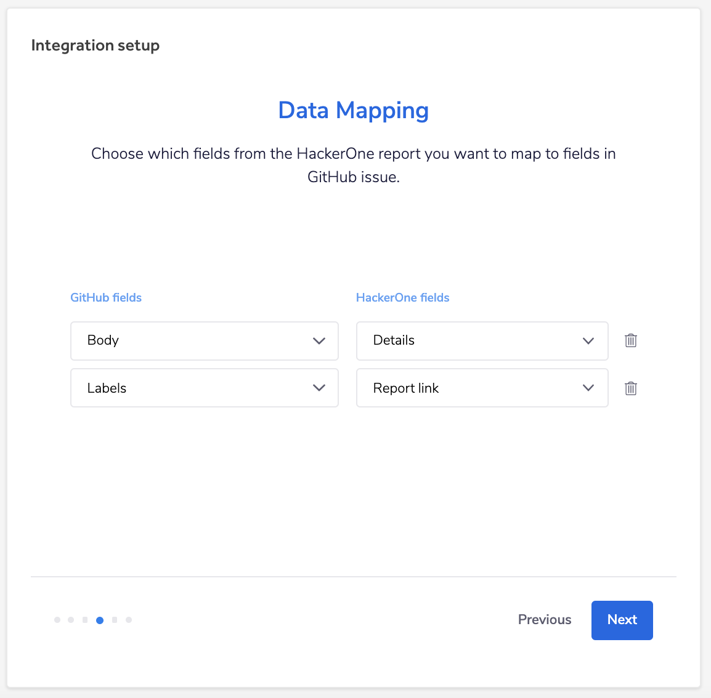
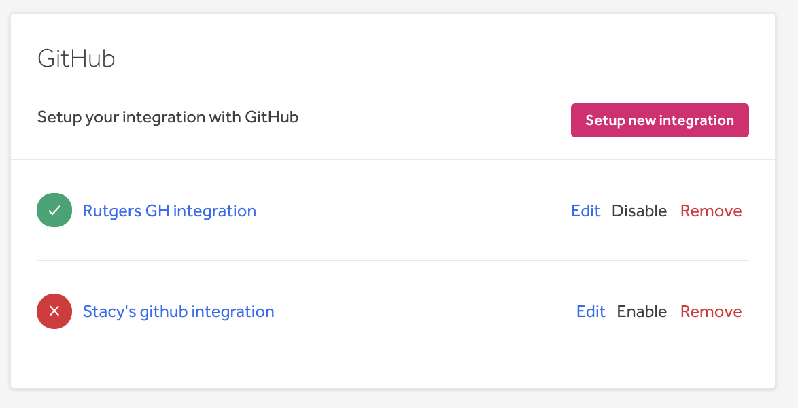
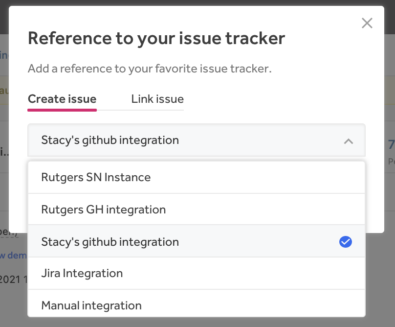
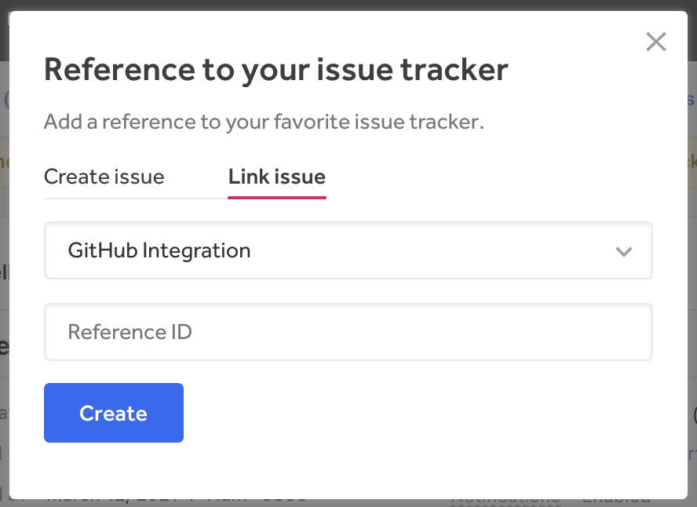

HackerOne offers a seamless two-way workflow integration enables tracking and synchronization of vulnerability reports between HackerOne and GitHub. This means that GitHub users can sync specific workflows from GitHub to HackerOne and vice versa, from HackerOne to GitHub. This integration contributes to a better workflow in managing security vulnerabilities as it minimizes the back and forth between GitHub and HackerOne.

- Reduce time to remediation with automated workflows - Simplify the triage and remediation process with a seamless handoff to your development team.
One-click integration between HackerOne and GitHub - Import the most critical data with one click - and create new GitHub issues in HackerOne with another.
- Customize synchronization in both directions - Decide what status changes matter most to your team, and sync from HackerOne to GitHub - or vice versa.
- Stay up to date on changes to your GitHub issues and HackerOne reports. This integration will help your teams build in more protection at every step by automatically syncing activities between HackerOne and GitHub. You’ll be able to create a GitHub issue from your HackerOne report with one click and have all the information from the HackerOne report available in GitHub to track progress and take action.

### Setup
You can install this integration using the steps below, or via the GitHub Marketplace: https://github.com/marketplace/hackerone-for-github.

To set up your integration with GitHub:
1. Go to **Program Settings > Program > Integrations**.
2. Click **Connect with GitHub**.

3. Click **Set up new integration**.

4. Enter a name for your integration.
5. *(Optional)* Enter a description.

6. Click **Next**.
7. Click **New authentication**.

8. Specify an **authentication name** and click **Create**.

9. Click **Authorize Hacker0x01** to give HackerOne access to your GitHub account.  

10. Click **Next** after seeing that your GitHub account has been connected.

11. Enter your GitHub username in the **Owner** field.
12. Select the name of the repository you want to connect to.

13. Click **Next**.
14. Select which HackerOne report fields you would like mapped to the corresponding GitHub field and then click **Next**.

15. Select which actions in HackerOne you’d like to post to GitHub as an event. You can choose from:

Option | Details
------ | -------
Comments | When someone comments on a report, post an update on the associated GitHub issue.
State Changes | When someone changes the state of a report, post an update on the associated GitHub issue.
Rewards | When someone awards or suggests a bounty and/or bonus, post an update on the associated GitHub issue.
Assignee Changes | When someone assigns a user/group to a report, post an update on the associated GitHub issue.
Disclosure | When disclosure is requested or a report becomes public, post an update on the associated GitHub issue.

16. Select which actions in GitHub you’d like to post to HackerOne as an event. You can choose from:

Option | Details
------ | -------
Comment added | Post an internal comment when someone comments on a GitHub issue.
When issue closes | You can choose from:  <ul><li>Close HackerOne report</li><li>Do nothing</li>

17. Click **Finish**.

You’ll now see your created GitHub integration listed at the top of the page. Click **Enable** next to your integration to make it live.

### How it works
With the GitHub integration, you can:
* Create a GitHub issue from your HackerOne report
* Link your HackerOne reports to existing GitHub issues

#### Creating a GitHub issue
Once your GitHub integration has been set up, to create an issue in GitHub from your HackerOne report:
1. Go to your program’s **Inbox** and select a report.
2. Click **Edit** next to the **References** field.

3. Select the correct integration you want to add a reference to.

4. Click **Create**.

The HackerOne report will now show as an issue in your GitHub repository.

*Comment in GitHub*:

*How the comment in GitHub shows up on the HackerOne report*:

#### Linking HackerOne reports to existing GitHub issues
To link your HackerOne report to a GitHub issue:
1. Go to the HackerOne report in your inbox that you want to link to GitHub.
2. Click **Edit** next to *References*.

3. Click the **Link issue** tab in the **Reference to your issue tracker** window.

4. Select your GitHub integration in the drop-down.
5. Enter the GitHub issue number in the **Reference ID** field.
6. Click **Create**.

Your HackerOne report will now be linked to the GitHub issue.  
