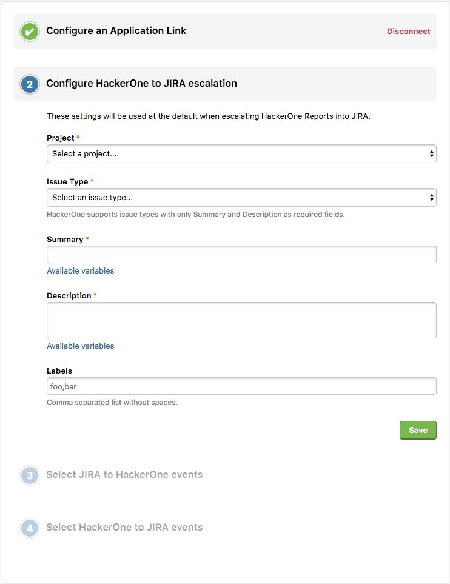

HackerOne 

HackerOne offers a bi-directional Jira integration that syncs information between your HackerOne report and the Jira issue. You can choose to integrate with Jira Cloud or Jira Server. 

To integrate with Jira Server:
1. Go to **Settings > Program > Integrations**.
2. Click the **Connect with JIRA** link.
   

3. Choose **JIRA Server**, and you'll be redirected to this 4-step setup screen where you can configure your Jira integration.
   

   

4. Enter the URL of the Jira instance you want to authenticate with in the **Instance base URL** field in the **Configure an Application Link** step.
5. Click the **Authenticate with JIRA** button to finalize the set up between HackerOne and your Jira instance.  
6. *(Optional)* Configure which HackerOne reports you'd like to escalate to Jira in the **Configure HackerOne to JIRA escalation** window.
   

7. *(Optional)* Select which Jira actions you'd like to post onto HackerOne in the **Select JIRA to HackerOne events** window. You can choose from:

Option | Detail
------ | -------
Status changed | Post an internal comment when an issue changes status.
Resolution changed | Post an internal comment when an issues changes resolution.
Priority changed | Post an internal comment when an issues changes priority.
Assignee changed | Post an internal comment when an issue changes assignee.
Comment added | Post an internal comment when someone comments on an issue. 

   
   
8. *(Optional)* Select which actions in HackerOne you'd like to post to Jira in the **Select HackerOne to JIRA events** window. You can choose from:

Option | Detail
------ | -------
Comments | When someone comments on a report, post an update on the associated Jira issue.
State Chagnes | When someone changes the state of a report, post an update on the associated Jira issue.
Rewards | When someone awards or suggests a bounty and/or bonus, post an update on the associated Jira issue.
Assignee Changes | When someone assigns a user/group to a report, post an update on the associated Jira issue.
Public Disclosure | When public disclosure is requested or a report becomes public, post an update on the associated Jira issue. 

   

You're all set! Now that you've finished setting up the Jira integration, you can create Jira issues right from your HackerOne report. 
