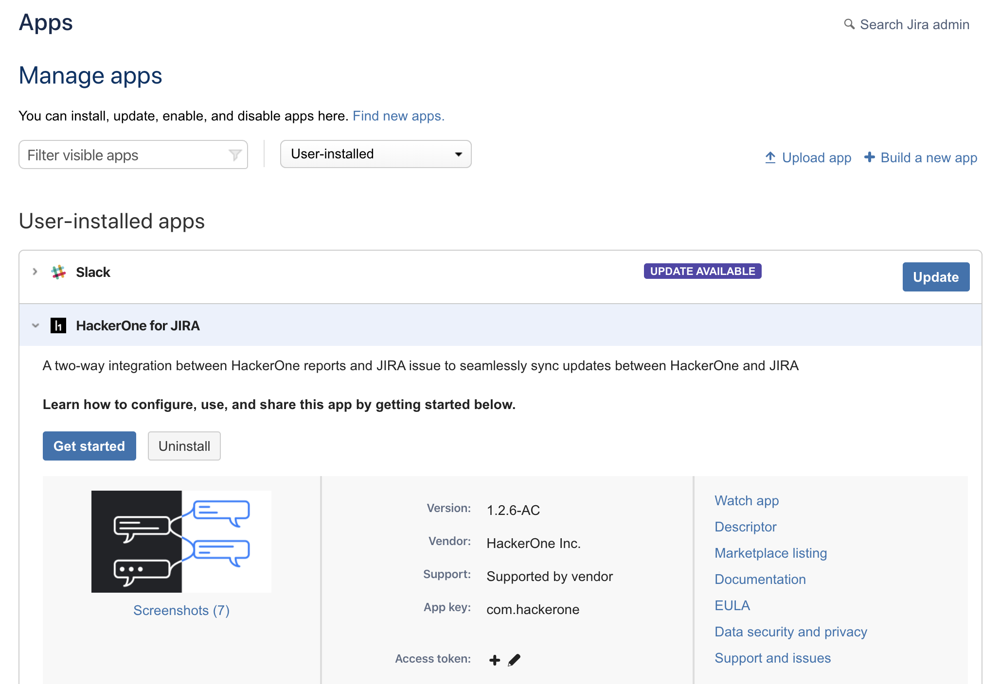
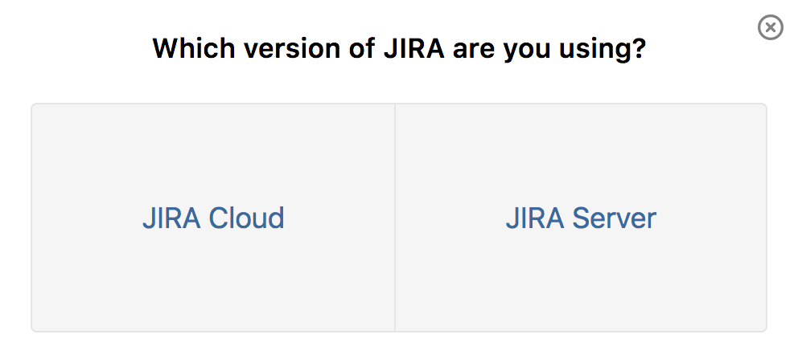
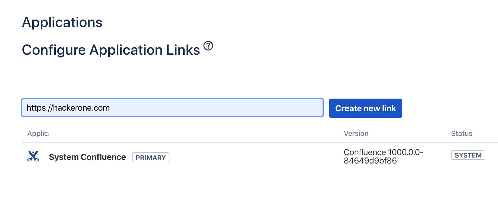
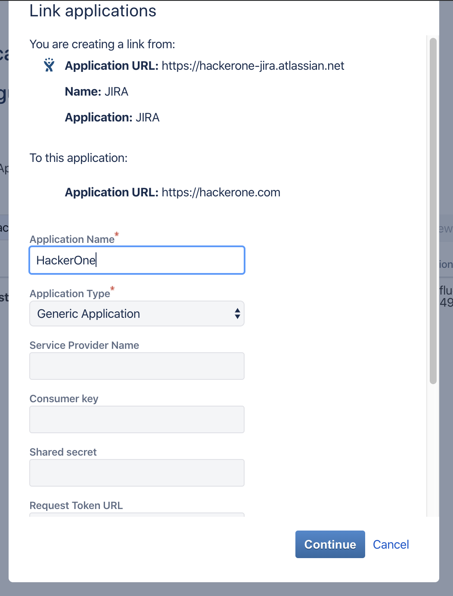
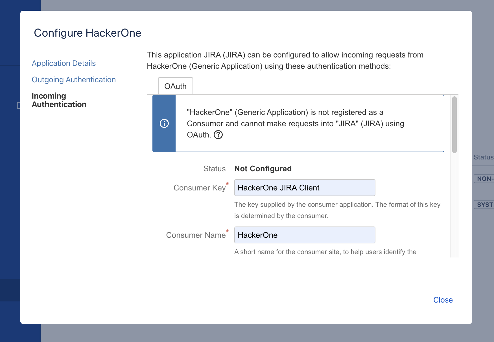
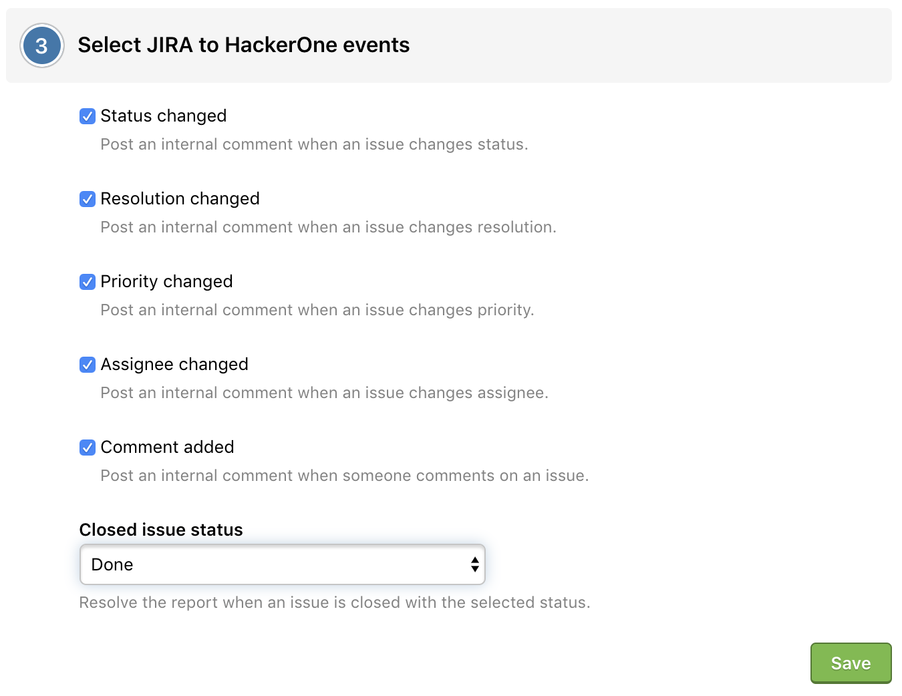

If you have multiple HackerOne programs, you can integrate them to the same Jira instance.

> These instructions are specifically for Jira Cloud users.

To integrate multiple HackerOne programs to the same Jira instance:

1. Remove the “HackerOne for Jira” plugin if you’re using Jira Cloud.
   <br>a) Go to [Jira](https://www.atlassian.com/software/jira).
   <br>b) Navigate to **Jira settings > Apps > Manage Apps**.
   <br>c) Click on the **HackerOne for Jira** app.
   <br>d) Click **Uninstall**.



2. Navigate back to HackerOne.
3. Go to **Settings > Program > Integration**.
4. Click the **Connect with Jira** link.
5. Choose **Jira Server** and you’ll be redirected to this 4-step setup screen where you can configure your Jira integration.




6. Navigate to the Configure Application Links console of Jira by going to **Jira Settings > Products > Application links**.



7. Enter `https://hackerone.com` to the field.
8. Click **Create new link**.
9. Ignore the warning message.


10. Click **Continue**.
11. Enter `HackerOne` for the **Application Name**.



12. Enter `Generic Application` for the **Application Type**.
13. Click **Continue**.
14. Click on the pencil icon on the **Configure Application Links** page to edit the HackerOne application.


15. Select **Incoming Authentication** on the left sidebar.



16. Enter the following information on the **Incoming Authentication** section of the Configure HackerOne window:

Field | Details
----- | --------
Consumer Key | HackerOne Jira Client
Consumer Name | HackerOne
Public Key | Copy and paste from the key below

**HackerOne Jira public key**
```
-----BEGIN PUBLIC KEY-----
MIICIjANBgkqhkiG9w0BAQEFAAOCAg8AMIICCgKCAgEAy8H4gLqU2Lkkce11/Scn
zac5uLs4Wa3xkg8pwTJb4AaUXxPp5c49MVXRlGhLMeQ2Wv1AfNvxJu4gcmvUyn6Q
A9hD156grA7qXD3G7aX4DJ4N5ialNaDQGZCWRqxAqwrT7KoXZohbiima5bAyUjgG
SwdGKTIHp7djBNfWa8Wv9uDbJZkNRkhzcuJ65dmsPk0gURosCzo3FhL9e0kjVt66
GbTMjP02L0BZYpFhwTbHTsrw/xpmW9RRDGZ9jYNXbCeki17bYdVSdGswvamvzv5Y
4EBK4hV4ocs+MumEWC5lYn1zdWjXaQcDTnrQLgF1BJ//hB7l6nPSrynYCiM4ceCU
vo1/2p6nOvNvbBjVlRMIYbsrrUgaBT1tvdHRqTkBDpxzDEQcNBuEgxhxu7oHNDvK
HnZsorPPvfixqhpB3jcO9NuYujPakAV/ishjrwwQtRIRXqLAFHYYQxbzfikhi0xs
RJGg/kzpkmz9F93cATONpMFSVrg6a4Vxmt0Yt8zND2WNi/8qHCWN2yju2DUWLLRm
6MdAkz48MMTCmYXRybB+6g8a9F4YBdl2TGnWsYfQ1R/y0utRKBC+P7cQwVTP8eus
liA2Ts+KvYyVgD6StR629HFyNCNglm9+NuudtYdUUfIHGlEq769wLwHX3bgddqBW
hgko43a2w0IWTvNkga5FBcMCAwEAAQ==
-----END PUBLIC KEY-----
```

19. Click **Save**.

20. Navigate back to HackerOne and enter the URL of the Jira instance you want to authenticate with in the **Instance base URL** field in the **Configure an Application Link** step.
   

21. Click the **Authenticate with Jira** button to finalize the setup between HackerOne and your Jira instance.

22. Configure which HackerOne projects you'd like to escalate to Jira in the **Configure HackerOne to Jira escalation** window.
     * Select the **Allow me to select a project every time when I escalate an issue** checkbox to have the ability to select from multiple projects when creating Jira issues.
     * Select the Jira Priority you want to map to the corresponding HackerOne severity. This enables the right priority to be set when escalating a HackerOne report to Jira.

   

23. *(Optional)* Select which Jira actions you'd like to post onto HackerOne in the **Select Jira to HackerOne events** window. You can choose from:

Option | Detail
------ | -------
Status changed | Post an internal comment when an issue changes status.
Resolution changed | Post an internal comment when an issues changes resolution.
Priority changed | Post an internal comment when an issue changes priority.
Assignee changed | Post an internal comment when an issue changes assignee.
Comment added | Post an internal comment when someone comments on an issue.
Closed issue status | Resolve the report when an issue is closed with the selected status.

   

24. *(Optional)* Select which actions in HackerOne you'd like to post to Jira in the **Select HackerOne to Jira events** window. You can choose from:

Option | Detail
------ | -------
Comments | When someone comments on a report, post an update on the associated Jira issue.
State Changes | When someone changes the state of a report, post an update on the associated Jira issue.
Rewards | When someone awards or suggests a bounty and/or bonus, post an update on the associated Jira issue.
Assignee Changes | When someone assigns a user/group to a report, post an update on the associated Jira issue.
Disclosure | When disclosure is requested or a report becomes public, post an update on the associated Jira issue.
Synchronize attachments | Synchronize attachments linked with reports and comments to the associated Jira issue.

   

25. Follow steps 20-24 for each subsequent program you need to add an integration for. *Note:You only need to follow steps 20-24 for your other programs because the application link has already been created when integrating with your first program, and only 1 application link is needed to set up a Jira integration.*
