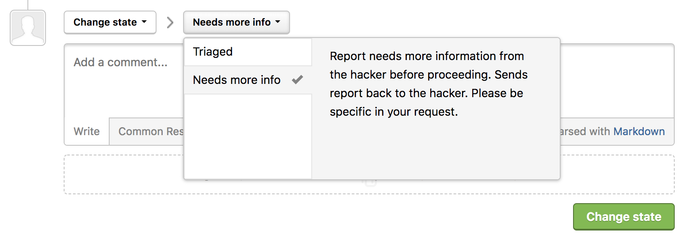

There are 5 actions you can take on a report in your inbox:
* Add comment
* Close report
* Change state
* Assign report
* Set award

### Add Comment
You can dialogue with hackers or team members or make notes about the report through adding comments. 

To add a comment:
1) Go to the bottom of the report above the comment box.
2) Make sure the action picker is set to **Add comment**. 
3) Select who you would like to make the comment visible to. You can select from these options:

   Option | Detail
   ------ | -------
   Team only | Only the members of your program will be able to view the comment.
   All participants | All participants of the report will be able to view the comment.

*Note: When you adding a comment to your internal team only, the comment box will turn red.*

### Close Report
You can close a report to mark that it's either:
* Resolved
* Informative
* Not Applicable
* Duplicate
* Spam 

To close a report:
1) Go to the bottom of the report above the comment box.
2) Select **Close report** in the action picker.
3) Select the status of the report in the **Select status** action picker. 
4) Click **Close report**. 

### Change State
You can change the state of a report to be marked as either *triaged* or *new*. This'll help you keep track of what state your report is in. 

To change the state of a report:
1) Go to the bottom of the report above the comment box.
2) Change the action picker from **Add comment** to **Change state** from the drop-down.  
3) Select the state of the report. You can chose from:
   
   Option | Detail
   ------ | -------
   Triaged | The report has passed the initial validation and is pending resolution. You can briefly describe the next steps in the comments section such as further investigation, escalation, engineer preparing a fix. *(Optional) When you select triage, you can enter the reference ID to your integration in the **Reference ID** field.* 
   New | The report is pending triage and validation. 
   
4) When the report is 
   
4) Click **Change state**. 

### Assign Report
You can assign reports to individual members in your program or to groups to evaluate and take action on the report. 

To assign a report:
1) Go to the bottom of the report above the comment box.
2) Change the action picker from **Add comment** to **Assign report** from the drop-down.  
3) Enter the username of the assignee or the group. 
4) Click **Assign report**. 

### Set Award
You can mark that you've rewarded a hacker with swag or a monetary amount through setting awards.

To set an award to a hacker for the report:
1) Go to the bottom of the report above the comment box.
2) Change the action picker from **Add comment** to **Set award** from the drop-down.  
3) Select the type of award you want to reward the hacker with. You can choose from these options: 

   Option | Detail
   ------ | ------
   Amount | Mark that you've rewarded the hacker with a specific dollar amount for the vulernability. 
   None ( ineligible) | The report is ineligible for a bounty. It's best to explain the reasons to hackers in the comments section, why the report is ineligible. 
   Suggest amount | Sugest a bounty amount to award the hacker. Only internal members of your program will be able to view your bounty suggestion. 
   Swag | Mark that you've rewarded the hacker with swag. 
 
 4) Click **Set award**. 
 
 
