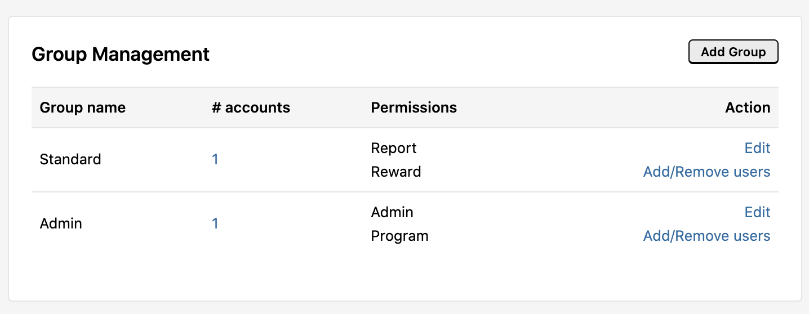

HackerOne offers Just-in-time (JIT) provisioning with [SSO via SAML](single-sign-on-sso-via-saml.html). JIT provisioning enables you to automatically create user accounts by using the information from the SAML protocol. 

When SSO via SAML has been set up, each time a new user from your organization logs in to HackerOne, their account will automatically be created. There are 2 types of provisioning that are associated in the creation of each account: Attribute Provisioning and Program Membership.

### Attribute Provisioning

By default, all accounts will be provisioned with and keep up to date the following attributes:
 - First name
 - Last name

### Program Membership

All SAML users have access to the platform by default, but do not necessarily have access to programs. This will help you understand the options that are available to you when configuring your SAML settings.

#### None

Without any program membership provisioning, you can invite users to your program and manage their membership and permission level within the user management interface.

#### Basic

The basic configuration allows any user attached to your SAML configuration to join the program automatically without an invitation at login. This works for multiple programs if your SAML settings are attached to all programs.

To configure this provisioning, contact support@hackerone.com after your SAML configuration is enabled and we will turn it on for you.

#### Advanced

The advanced configuration allows organizations to control membership and permission level from their SSO provider. When configured, the attributes for the users membership and group will be used to assign the user to your program and the appropriate group in HackerOne with the associated permissions.

To configure this provisioning we need to establish a mapping between the SSO provider (your system) and the HackerOne system. We do this by utilizing the attribute statements on the SSO provider side, which you will point to groups defined in your HackerOne program.

The assertion should provide an attribute with the following name: `Program.<handle>.groups` and the value should be a semi-colon delimited list of the program Group names the user should belong to. If no groups are specified the user will not be added to the program.

Take, for example, this set of configured Groups in HackerOne:


A correlating SSO configuration (for Okta) would look like this:


We can confirm the mapping is done correctly by inspecting the assertion statement in the SAML Response:
```
<saml2:AttributeStatement xmlns:saml2="urn:oasis:names:tc:SAML:2.0:assertion">
   <saml2:Attribute Name="user.firstName" NameFormat="urn:oasis:names:tc:SAML:2.0:attrname-format:unspecified">
     <saml2:AttributeValue xmlns:xs="<snip>" xsi:type="xs:string">Ben</saml2:AttributeValue>
   </saml2:Attribute>
   <saml2:Attribute Name="User.lastName" NameFormat="urn:oasis:names:tc:SAML:2.0:attrname-format:unspecified">
     <saml2:AttributeValue xmlns:xs="<snip>" xmlns:xsi="<snip>" xsi:type="xs:string">Willis</saml2:AttributeValue>
   </saml2:Attribute>
   <saml2:Attribute Name="Program.security.groups" NameFormat="urn:oasis:names:tc:SAML:2.0:attrname-format:unspecified">
     <saml2:AttributeValue xmlns:xs="<snip>" xmlns:xsi="<snip>" xsi:type="xs:string">Admin;Standard</saml2:AttributeValue>
   </saml2:Attribute>
   <saml2:Attribute Name="Program.hackerone_program_2.groups" NameFormat="<snip>">
     <saml2:AttributeValue xmlns:xs="<snip>" xmlns:xsi="<snip>" xsi:type="xs:string">Standard</saml2:AttributeValue>
   </saml2:Attribute>
 </saml2:AttributeStatement>
 ```

Additionally, you can confirm the memberships are being added properly by viewing your Program Audit log.
