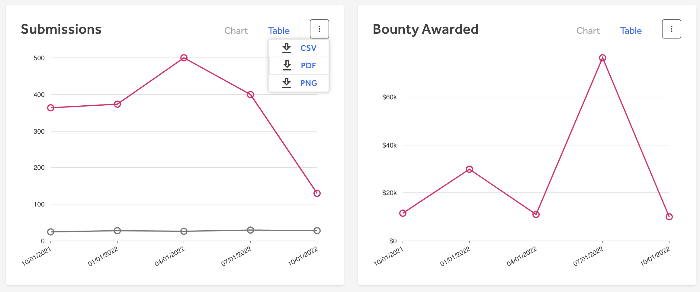
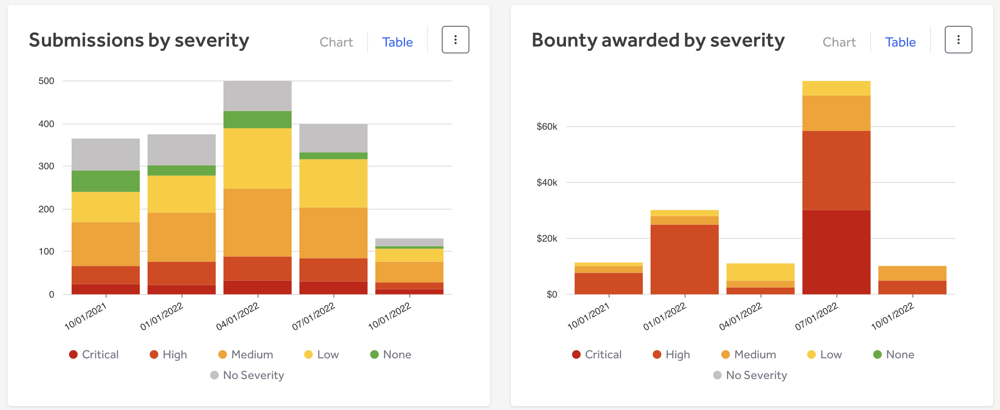
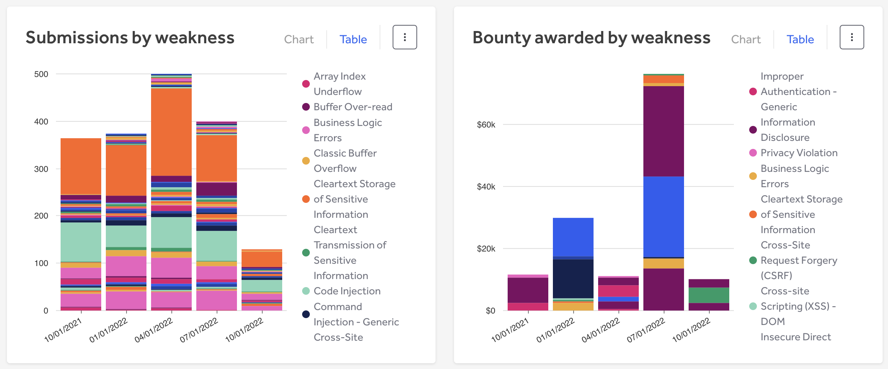
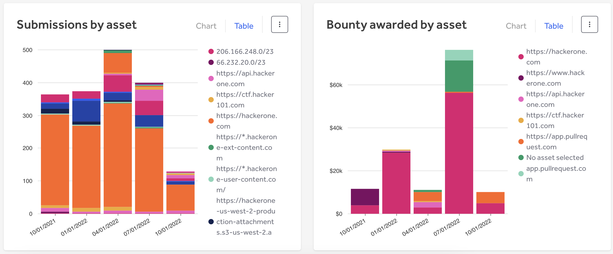
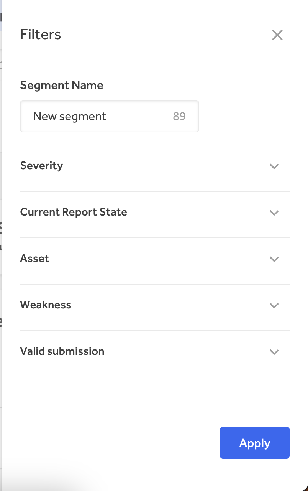

The Submissions & Bounty Dashboard shows metrics data on hacker submissions for your programs. Bounty programs will show the number of valid submissions for that category on the left, with bounties paid out for that category on the right. You can export all of your data at once as a PDF or by sections as a CSV, PDF, or PNG image file.

### Summary
The Summary section at the top shows a row of cards which provide a quick overview of your report submission metrics.
*Note: All submissions data is anchored by the report's submission date, and the bounty data is anchored by the date the bounty was paid out.*

Item | Details
---- | ----------
Submissions |The total number of reports submitted to the program during the selected time interval.
Resolved or Triaged | The number of reports submitted during the selected time interval that are currently Triaged or closed as Resolved.
Valid | The percentage of valid reports submitted during the selected time interval. Percentage is calculated by dividing the total number of resolved or triaged reports by the total number of submissions.
Bounty Awarded | The amount of bounty paid out during the selected time interval.
Reports Awarded | The number of reports that received an award during the selected time period.

### Download Options
Each of the charts below allows you to download the chart as CSV, PDF, or PNG image files using the kabob menu (three vertical dots).

### Submissions & Bounty
The Submissions & Bounty section shows the amount of valid submissions and the total bounty paid out during the selected time period compared to the average for all HackerOne customers.

### Severity
The Severity section shows how reports and bounties are distributed by severity. You can view trends on how many valid reports are submitted and paid bounty per severity.

### Weakness
The Weakness section shows how your reports are spread among the different weakness types. You can view what areas you’re receiving the most valid vulnerabilities in so that you can know which vulnerabilities your program is most susceptible to.

You can see your weakness data by the number of valid reports and also by bounty amounts.

### Asset
The Assets section enables you to explore reports and bounties by asset. You can see which asset you’re receiving the most vulnerabilities in and how much bounty is paid out per asset.

You can view your asset data by the number of valid reports and also by bounty amounts.

### Functionality
The date and filter section allows you to set the date range and interval of your results, as well as filter the results based on severity, current report state, assets, weaknesses, or anchor date.

To change the interval, select an option in the dropdown next to the date range and choose an interval based on your selected date range. For example, if you choose a date range of 1 year, your interval options may be “yearly” or “quarterly”.

To change the date, click the dropdown arrow next to the date and set your desired date range. You can choose a preset time range or set your own custom range.

### Segments
Segments allow you to save filtering and date selections that you need to look at regularly without having to redo them every time you visit the page. For example, you can create a segment for all critical findings, or based on particular assets.

**Note:** The segments are saved on your local browser, not on the server. Others cannot see your segments. Deleting cookies will delete the segments.

1. Click **Add Segment**

2. Apply desired filters

3. Click Save as Segment

4. When you log in, click the segment tab

To edit a segment:
1. Select the segment
2. Click the **filter** button
3. Edit filters as normal
4. Click **Update Segment**
